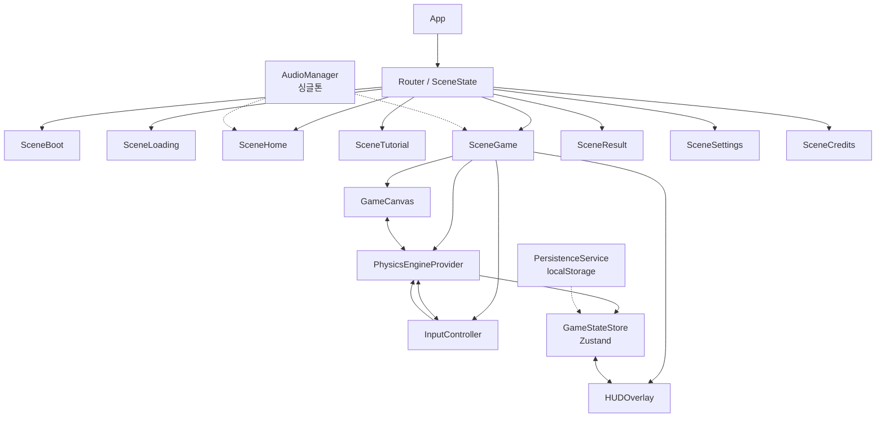
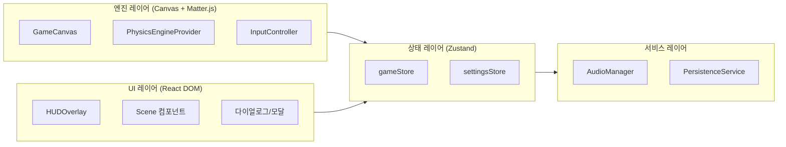
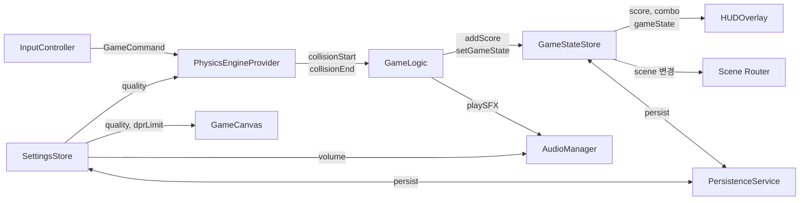
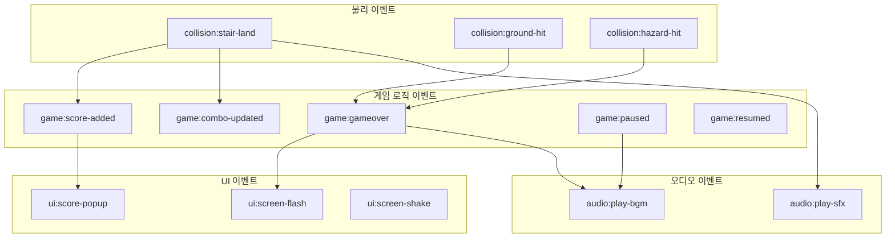

# 게임 아키텍처 및 컴포넌트 설계 구현 계획서

> **프로젝트**: 무한 계단 (Infinite Stairs) — React + Matter.js 기반 웹 캐주얼 게임
> **작성일**: 2026-02-18
> **기반**: PRD Task 1 (기술 리서치), Task 5 (컴포넌트 설계)

---

## 목차

1. [전체 아키텍처 다이어그램](#1-전체-아키텍처-다이어그램)
2. [핵심 컴포넌트 상세 설계](#2-핵심-컴포넌트-상세-설계)
3. [데이터 흐름](#3-데이터-흐름)
4. [상태 관리 설계 (Zustand Store 구조)](#4-상태-관리-설계-zustand-store-구조)
5. [이벤트 시스템 설계](#5-이벤트-시스템-설계)
6. [코드 예시](#6-코드-예시)

---

## 1. 전체 아키텍처 다이어그램

### 1.1 컴포넌트 관계 다이어그램



### 1.2 레이어 아키텍처 다이어그램



### 1.3 설계 원칙

| 원칙 | 설명 |
|------|------|
| **물리/렌더 분리** | 물리 시뮬레이션과 Canvas 렌더링은 React 렌더 사이클 바깥에서 동작한다. `requestAnimationFrame` + fixed timestep 패턴을 사용한다. |
| **React는 UI 전담** | React DOM은 HUD, 메뉴, 다이얼로그 등 UI만 담당한다. 게임 오브젝트의 좌표/회전은 React state에 넣지 않는다. |
| **ref 기반 게임 상태** | 매 프레임 변경되는 값(바디 위치, 회전, 속도 등)은 `useRef`로 관리하여 불필요한 리렌더를 방지한다. |
| **최소한의 store 구독** | Zustand store에는 UI 표시에 필요한 파생 데이터(점수, 게임 상태, 설정 등)만 저장한다. |
| **이벤트 기반 통신** | 컴포넌트 간 결합도를 낮추기 위해 EventEmitter 패턴으로 통신한다. |

---

## 2. 핵심 컴포넌트 상세 설계

### 2.1 GameCanvas

**책임**: `<canvas>` 요소의 생성/리사이즈, DPR(devicePixelRatio) 관리, 렌더 루프 구동

**설계 원칙:**

- Canvas의 논리적 해상도(canvas.width/height)와 CSS 크기를 분리하여 Retina 디스플레이를 지원한다.
- `ResizeObserver`로 컨테이너 크기 변화를 감지하고, DPR은 최대 2x로 제한하여 성능을 보장한다.
- 게임 루프에서 `setState`를 호출하지 않는다. 모든 프레임 데이터는 `ref`로 관리한다.
- 렌더링은 Canvas 2D Context의 `drawImage`, `fillRect` 등을 직접 호출한다.

**인터페이스:**

```typescript
interface GameCanvasProps {
  /** 물리 엔진 참조 (프레임마다 바디 위치를 읽어 렌더링) */
  engineRef: React.RefObject<Matter.Engine>;
  /** 카메라 변환 정보 */
  cameraRef: React.RefObject<CameraTransform>;
  /** 품질 설정 (DPR 제한, 파티클 on/off 등) */
  quality: QualitySettings;
}

interface CameraTransform {
  /** 월드→화면 변환 스케일 */
  scale: number;
  /** 화면 X 오프셋 (중앙 정렬) */
  offsetX: number;
  /** 화면 Y 오프셋 (스크롤) */
  offsetY: number;
}

interface CanvasSize {
  /** CSS 픽셀 기준 너비 */
  width: number;
  /** CSS 픽셀 기준 높이 */
  height: number;
  /** devicePixelRatio (최대 2) */
  scale: number;
}
```

**핵심 동작 흐름:**

```
1. mount → ResizeObserver 등록
2. ResizeObserver 콜백 → canvas.width/height 갱신 + CSS 크기 설정
3. rAF 루프 시작 → 매 프레임:
   a. ctx.clearRect(전체)
   b. ctx.save() → 카메라 변환 적용 (translate + scale)
   c. 게임 오브젝트 렌더링 (배경 → 계단 → 캐릭터 → 이펙트)
   d. ctx.restore()
   e. HUD 오버레이용 데이터는 store에 최소한만 push
4. unmount → ResizeObserver 해제, rAF 취소
```

---

### 2.2 PhysicsEngineProvider (Context)

**책임**: Matter.js 물리 월드 인스턴스의 생명주기 관리, 고정 타임스텝 시뮬레이션, 충돌 이벤트 디스패치

**설계 원칙:**

- Matter.js `Engine`, `World` 인스턴스를 `useRef`로 보관하여 React 렌더 사이클과 완전히 분리한다.
- 물리 업데이트는 `requestAnimationFrame` + accumulator 패턴으로 60Hz 고정 타임스텝을 유지한다.
- 충돌 이벤트는 Matter.js의 `Events.on(engine, 'collisionStart', ...)` 를 통해 감지하고, 게임 로직에 전달한다.
- Context를 통해 하위 컴포넌트에 엔진 참조와 유틸리티 함수를 제공한다.

**인터페이스:**

```typescript
interface PhysicsContextValue {
  /** Matter.js 엔진 인스턴스 (ref) */
  engineRef: React.RefObject<Matter.Engine>;
  /** Matter.js 월드 인스턴스 (ref) */
  worldRef: React.RefObject<Matter.World>;
  /** 물리 월드에 바디 추가 */
  addBody: (body: Matter.Body) => void;
  /** 물리 월드에서 바디 제거 */
  removeBody: (body: Matter.Body) => void;
  /** 바디에 힘/충격량 적용 */
  applyForce: (body: Matter.Body, force: Matter.Vector) => void;
  /** 게임 이벤트 에미터 */
  eventEmitter: GameEventEmitter;
  /** 현재 물리 시뮬레이션 활성 여부 */
  isRunning: boolean;
  /** 시뮬레이션 일시정지/재개 */
  setPaused: (paused: boolean) => void;
}

interface PhysicsEngineProviderProps {
  children: React.ReactNode;
  /** 중력 벡터 (기본: { x: 0, y: 1 }) */
  gravity?: Matter.Vector;
  /** 고정 타임스텝 (기본: 1/60) */
  fixedDt?: number;
  /** 최대 서브스텝 수 (기본: 3) */
  maxSubsteps?: number;
}
```

**고정 타임스텝 + Accumulator 패턴:**

```
프레임 시작:
  frameTime = (now - lastTime) / 1000
  frameTime = min(frameTime, FIXED_DT * MAX_SUBSTEPS)  // 스파이크 방지
  accumulator += frameTime

  while accumulator >= FIXED_DT && steps < MAX_SUBSTEPS:
    Matter.Engine.update(engine, FIXED_DT * 1000)
    accumulator -= FIXED_DT
    steps++

  interpolation = accumulator / FIXED_DT  // 부드러운 렌더링용 보간값
```

---

### 2.3 InputController

**책임**: 마우스/터치 입력을 PointerEvents API로 통합 수집하고, 게임 명령 이벤트로 변환하여 출력

**설계 원칙:**

- `PointerEvents`를 사용하여 마우스, 터치, 펜 입력을 단일 코드 경로로 처리한다.
- Canvas 요소에 `touch-action: none` CSS를 적용하여 브라우저 기본 제스처(스크롤, 줌)를 차단한다.
- 화면 좌표를 월드 좌표로 변환한 뒤, 게임 명령(왼발/오른발 스텝)으로 매핑한다.
- 입력 해석 결과는 EventEmitter를 통해 PhysicsEngineProvider에 전달한다.

**인터페이스:**

```typescript
/** 게임 입력 명령 */
type GameCommand =
  | { type: "step-left" }
  | { type: "step-right" }
  | { type: "pause" }
  | { type: "resume" };

interface InputControllerProps {
  /** 입력 이벤트를 바인딩할 canvas 요소 ref */
  canvasRef: React.RefObject<HTMLCanvasElement>;
  /** 게임 명령 발생 시 호출되는 콜백 */
  onCommand: (command: GameCommand) => void;
  /** 입력 활성화 여부 */
  enabled: boolean;
}

interface PointerState {
  isDown: boolean;
  x: number;
  y: number;
  pointerId: number;
  pointerType: "mouse" | "touch" | "pen";
}

interface TouchZone {
  id: string;
  /** 터치 영역의 좌측 경계 (화면 비율 0~1) */
  xMin: number;
  /** 터치 영역의 우측 경계 (화면 비율 0~1) */
  xMax: number;
  /** 매핑되는 게임 명령 */
  command: GameCommand;
}
```

**입력→명령 변환 흐름:**

```
pointerdown 이벤트 발생
  ↓
화면 좌표 → 정규화 좌표 (0~1)
  ↓
터치 존 판정:
  x < 0.5 → "step-left"
  x >= 0.5 → "step-right"
  ↓
onCommand(command) 호출
  ↓
PhysicsEngineProvider에서 캐릭터 바디에 힘 적용
```

---

### 2.4 GameStateStore (Zustand)

**책임**: 게임 진행 상태(점수, 게임 상태, 설정)의 중앙 관리. UI 컴포넌트가 구독하여 화면에 반영한다.

**설계 원칙:**

- 물리 바디의 실시간 좌표(position, angle, velocity)는 store에 절대 넣지 않는다.
- store에는 UI 표시/Scene 라우팅에 필요한 **파생 데이터**만 저장한다.
- `immer` 미들웨어 없이 불변 업데이트를 수행한다(얕은 복사).
- `persist` 미들웨어로 localStorage 자동 저장을 지원한다.
- selector를 세밀하게 사용하여 불필요한 리렌더를 방지한다.

**인터페이스:**

```typescript
/** 게임 장면(Scene) 상태 */
type SceneType =
  | "boot"
  | "loading"
  | "home"
  | "tutorial"
  | "game"
  | "result"
  | "settings"
  | "credits";

/** 게임플레이 내부 상태 */
type GamePlayState = "ready" | "playing" | "paused" | "gameover";

interface GameStore {
  // --- Scene 라우팅 ---
  scene: SceneType;
  setScene: (scene: SceneType) => void;

  // --- 게임플레이 상태 ---
  gameState: GamePlayState;
  setGameState: (state: GamePlayState) => void;

  // --- 점수 ---
  score: number;
  combo: number;
  maxCombo: number;
  highScore: number;
  addScore: (points: number) => void;
  incrementCombo: () => void;
  resetCombo: () => void;

  // --- 남은 기회 ---
  lives: number;
  decrementLife: () => void;

  // --- 게임 초기화 ---
  resetGame: () => void;

  // --- 최고 기록 갱신 ---
  updateHighScore: () => void;
}

interface SettingsStore {
  // --- 오디오 ---
  masterVolume: number;
  bgmVolume: number;
  sfxVolume: number;
  bgmEnabled: boolean;
  sfxEnabled: boolean;
  setMasterVolume: (v: number) => void;
  setBgmVolume: (v: number) => void;
  setSfxVolume: (v: number) => void;
  toggleBgm: () => void;
  toggleSfx: () => void;

  // --- 그래픽 ---
  quality: "high" | "medium" | "low";
  setQuality: (q: "high" | "medium" | "low") => void;

  // --- 진동 ---
  vibrationEnabled: boolean;
  toggleVibration: () => void;

  // --- 튜토리얼 ---
  tutorialCompleted: boolean;
  completeTutorial: () => void;
}
```

---

### 2.5 HUDOverlay

**책임**: 게임플레이 중 점수, 콤보, 타이머, 일시정지 버튼 등을 React DOM으로 렌더링

**설계 원칙:**

- GameStateStore를 selector로 구독하여 변경된 값만 리렌더한다.
- Canvas 위에 `position: absolute`로 오버레이한다.
- `pointer-events: none`을 기본 적용하고, 버튼 등 인터랙티브 요소에만 `pointer-events: auto`를 부여한다.
- Safe-area inset을 적용하여 iOS 노치 영역을 회피한다.

**인터페이스:**

```typescript
interface HUDOverlayProps {
  /** 일시정지 버튼 클릭 시 콜백 */
  onPause: () => void;
}

// HUD 내부에서 사용하는 selector 예시
// const score = useGameStore((s) => s.score);
// const combo = useGameStore((s) => s.combo);
// const gameState = useGameStore((s) => s.gameState);
```

---

### 2.6 AudioManager

**책임**: BGM/SFX 재생 관리, 모바일 오디오 정책(AudioContext unlock) 처리, 볼륨 제어

**설계 원칙:**

- 싱글톤 패턴으로 앱 전체에서 하나의 AudioContext를 공유한다.
- Web Audio API 노드 그래프: `Source → GainNode(BGM/SFX) → GainNode(Master) → destination`
- 모바일 브라우저의 오디오 정책을 준수하기 위해, 첫 번째 사용자 인터랙션에서 `AudioContext.resume()`을 호출한다.
- SFX는 동시 재생 수를 제한하는 풀링 시스템을 적용한다 (동일 SFX 최대 3, 전체 최대 8).
- BGM은 단일 채널로 동시에 1곡만 재생하며, Scene 전환 시 크로스페이드(300ms)를 적용한다.
- `document.visibilitychange` 이벤트를 감지하여 백그라운드 진입 시 오디오를 일시정지한다.

**인터페이스:**

```typescript
interface IAudioManager {
  /** AudioContext 생성 및 모바일 unlock 핸들러 등록 */
  init(): void;
  /** AudioBuffer 등록 */
  registerBuffer(key: string, buffer: AudioBuffer): void;
  /** 다수 AudioBuffer 일괄 등록 */
  registerBuffers(buffers: Map<string, AudioBuffer>): void;

  // BGM
  playBGM(key: string): void;
  stopBGM(): void;
  pauseBGM(): void;
  resumeBGM(): void;

  // SFX
  playSFX(key: string): void;

  // 볼륨
  setMasterVolume(value: number): void;
  setBGMVolume(value: number): void;
  setSFXVolume(value: number): void;
  toggleBGM(enabled: boolean): void;
  toggleSFX(enabled: boolean): void;

  // 정리
  destroy(): void;
}
```

---

### 2.7 PersistenceService

**책임**: localStorage를 이용한 게임 진행 상태와 설정의 영속적 저장/복원

**설계 원칙:**

- 모든 읽기/쓰기는 try-catch로 감싸서 localStorage 접근 불가 환경(시크릿 모드 등)에서도 앱이 정상 동작하도록 한다.
- Zustand의 `persist` 미들웨어와 연동하여 자동 저장을 구현한다.
- 저장 데이터에 버전 필드를 두어 마이그레이션을 지원한다.

**인터페이스:**

```typescript
interface SaveData {
  version: number;
  highScore: number;
  tutorialCompleted: boolean;
  totalGamesPlayed: number;
}

interface IPersistenceService {
  /** 저장 데이터 로드 (없으면 기본값 반환) */
  load(): SaveData;
  /** 저장 데이터 저장 */
  save(data: Partial<SaveData>): void;
  /** 저장 데이터 초기화 */
  reset(): void;
}

interface SettingsSaveData {
  masterVolume: number;
  bgmVolume: number;
  sfxVolume: number;
  bgmEnabled: boolean;
  sfxEnabled: boolean;
  quality: "high" | "medium" | "low";
  vibrationEnabled: boolean;
}
```

---

## 3. 데이터 흐름

### 3.1 전체 데이터 흐름 다이어그램



### 3.2 흐름별 상세 설명

#### 입력 → 물리 (InputController → PhysicsEngineProvider)

```
1. 사용자가 화면 왼쪽/오른쪽을 터치
2. InputController가 PointerEvent를 감지
3. 화면 좌표를 정규화하여 터치 존 판정
4. GameCommand ("step-left" | "step-right") 생성
5. EventEmitter를 통해 PhysicsEngineProvider에 전달
6. PhysicsEngineProvider가 캐릭터 바디에 적절한 impulse 적용
```

#### 물리 → 게임 상태 (PhysicsEngineProvider → GameStateStore)

```
1. Matter.js 충돌 이벤트 발생 (collisionStart)
2. 충돌 쌍의 label로 충돌 유형 판별:
   - "character" + "stair" → 착지 성공 → addScore, incrementCombo
   - "character" + "ground" → 게임 오버 → setGameState("gameover")
   - "character" + "hazard" → 피해 → decrementLife
3. GameStateStore 업데이트
4. AudioManager에 SFX 재생 요청 (이벤트 기반)
```

#### 게임 상태 → UI (GameStateStore → HUDOverlay / Scene Router)

```
1. GameStateStore의 값이 변경됨
2. HUDOverlay: score, combo, lives selector로 구독 → 해당 부분만 리렌더
3. Scene Router: scene selector로 구독 → 씬 전환 트리거
4. Result Scene: highScore, score 표시
```

#### 설정 → 엔진/캔버스 (SettingsStore → PhysicsEngineProvider & GameCanvas)

```
1. 사용자가 Settings에서 품질 변경
2. SettingsStore 업데이트
3. PhysicsEngineProvider: maxBodies, sleeping 설정 반영
4. GameCanvas: DPR 상한, 파티클 on/off 반영
5. AudioManager: 볼륨 값 반영
```

---

## 4. 상태 관리 설계 (Zustand Store 구조)

### 4.1 gameStore

게임플레이 진행에 관련된 모든 상태를 관리한다.

```typescript
import { create } from "zustand";
import { persist } from "zustand/middleware";

interface GameState {
  // Scene 라우팅
  scene: SceneType;
  setScene: (scene: SceneType) => void;

  // 게임플레이
  gameState: GamePlayState;
  setGameState: (state: GamePlayState) => void;

  // 점수
  score: number;
  combo: number;
  maxCombo: number;
  highScore: number;

  // 기회
  lives: number;

  // 액션
  addScore: (points: number) => void;
  incrementCombo: () => void;
  resetCombo: () => void;
  decrementLife: () => void;
  resetGame: () => void;
  updateHighScore: () => void;
}

const INITIAL_LIVES = 1;

export const useGameStore = create<GameState>()(
  persist(
    (set, get) => ({
      // --- 초기값 ---
      scene: "boot",
      gameState: "ready",
      score: 0,
      combo: 0,
      maxCombo: 0,
      highScore: 0,
      lives: INITIAL_LIVES,

      // --- Scene ---
      setScene: (scene) => set({ scene }),

      // --- 게임 상태 ---
      setGameState: (gameState) => set({ gameState }),

      // --- 점수 ---
      addScore: (points) =>
        set((state) => ({
          score: state.score + points * Math.max(1, state.combo),
        })),

      incrementCombo: () =>
        set((state) => ({
          combo: state.combo + 1,
          maxCombo: Math.max(state.maxCombo, state.combo + 1),
        })),

      resetCombo: () => set({ combo: 0 }),

      // --- 기회 ---
      decrementLife: () =>
        set((state) => ({
          lives: Math.max(0, state.lives - 1),
        })),

      // --- 초기화 ---
      resetGame: () =>
        set({
          gameState: "ready",
          score: 0,
          combo: 0,
          maxCombo: 0,
          lives: INITIAL_LIVES,
        }),

      // --- 최고 기록 ---
      updateHighScore: () =>
        set((state) => ({
          highScore: Math.max(state.highScore, state.score),
        })),
    }),
    {
      name: "infinite-stairs-game",
      // highScore만 영속 저장, 나머지 게임 상태는 휘발
      partialize: (state) => ({
        highScore: state.highScore,
      }),
    }
  )
);
```

### 4.2 settingsStore

설정 관련 상태를 관리한다. 모든 값은 localStorage에 영속 저장된다.

```typescript
import { create } from "zustand";
import { persist } from "zustand/middleware";

interface SettingsState {
  // 오디오
  masterVolume: number;
  bgmVolume: number;
  sfxVolume: number;
  bgmEnabled: boolean;
  sfxEnabled: boolean;

  // 그래픽
  quality: "high" | "medium" | "low";

  // 진동
  vibrationEnabled: boolean;

  // 튜토리얼
  tutorialCompleted: boolean;

  // 액션
  setMasterVolume: (v: number) => void;
  setBgmVolume: (v: number) => void;
  setSfxVolume: (v: number) => void;
  toggleBgm: () => void;
  toggleSfx: () => void;
  setQuality: (q: "high" | "medium" | "low") => void;
  toggleVibration: () => void;
  completeTutorial: () => void;
}

export const useSettingsStore = create<SettingsState>()(
  persist(
    (set) => ({
      // --- 초기값 ---
      masterVolume: 1.0,
      bgmVolume: 0.7,
      sfxVolume: 1.0,
      bgmEnabled: true,
      sfxEnabled: true,
      quality: "high",
      vibrationEnabled: true,
      tutorialCompleted: false,

      // --- 액션 ---
      setMasterVolume: (v) => set({ masterVolume: Math.max(0, Math.min(1, v)) }),
      setBgmVolume: (v) => set({ bgmVolume: Math.max(0, Math.min(1, v)) }),
      setSfxVolume: (v) => set({ sfxVolume: Math.max(0, Math.min(1, v)) }),
      toggleBgm: () => set((s) => ({ bgmEnabled: !s.bgmEnabled })),
      toggleSfx: () => set((s) => ({ sfxEnabled: !s.sfxEnabled })),
      setQuality: (quality) => set({ quality }),
      toggleVibration: () => set((s) => ({ vibrationEnabled: !s.vibrationEnabled })),
      completeTutorial: () => set({ tutorialCompleted: true }),
    }),
    {
      name: "infinite-stairs-settings",
    }
  )
);
```

### 4.3 Store 구독 패턴

```typescript
// 나쁜 예: 전체 store를 구독하면 어떤 값이든 변경 시 리렌더
const store = useGameStore(); // 전체 구독 — 지양

// 좋은 예: selector로 필요한 값만 구독
const score = useGameStore((s) => s.score);
const combo = useGameStore((s) => s.combo);

// 여러 값을 하나의 selector로 묶기 (shallow 비교)
import { shallow } from "zustand/shallow";
const { score, combo, lives } = useGameStore(
  (s) => ({ score: s.score, combo: s.combo, lives: s.lives }),
  shallow
);
```

---

## 5. 이벤트 시스템 설계

### 5.1 설계 목적

컴포넌트 간 직접적인 의존성을 줄이고, 물리 엔진 → 게임 로직 → UI 업데이트를 느슨하게 연결하기 위해 EventEmitter 패턴을 사용한다.

### 5.2 이벤트 카탈로그



### 5.3 이벤트 타입 정의

```typescript
/** 게임 내 모든 이벤트를 정의하는 맵 */
interface GameEventMap {
  // --- 물리 충돌 이벤트 ---
  "collision:stair-land": {
    stairId: number;
    stairType: "normal" | "breaking" | "moving" | "slippery";
    position: { x: number; y: number };
  };
  "collision:ground-hit": {
    position: { x: number; y: number };
  };
  "collision:hazard-hit": {
    hazardType: string;
    position: { x: number; y: number };
  };

  // --- 게임 로직 이벤트 ---
  "game:score-added": {
    points: number;
    totalScore: number;
    combo: number;
  };
  "game:combo-updated": {
    combo: number;
    isNewMax: boolean;
  };
  "game:gameover": {
    finalScore: number;
    maxCombo: number;
    isHighScore: boolean;
  };
  "game:paused": {};
  "game:resumed": {};

  // --- 입력 명령 이벤트 ---
  "input:command": GameCommand;

  // --- 오디오 이벤트 ---
  "audio:play-sfx": { key: string };
  "audio:play-bgm": { key: string };
  "audio:stop-bgm": {};
}
```

### 5.4 EventEmitter 구현

```typescript
type EventHandler<T = unknown> = (data: T) => void;

export class GameEventEmitter {
  private listeners = new Map<string, Set<EventHandler<any>>>();

  on<K extends keyof GameEventMap>(
    event: K,
    handler: EventHandler<GameEventMap[K]>
  ): () => void {
    if (!this.listeners.has(event)) {
      this.listeners.set(event, new Set());
    }
    this.listeners.get(event)!.add(handler);

    // 구독 해제 함수 반환
    return () => {
      this.listeners.get(event)?.delete(handler);
    };
  }

  emit<K extends keyof GameEventMap>(event: K, data: GameEventMap[K]): void {
    const handlers = this.listeners.get(event);
    if (!handlers) return;
    for (const handler of handlers) {
      handler(data);
    }
  }

  removeAllListeners(): void {
    this.listeners.clear();
  }
}

// 싱글톤 인스턴스
export const gameEvents = new GameEventEmitter();
```

### 5.5 이벤트 연결 흐름 예시

```
[사용자 터치 — 왼쪽]
  → InputController: gameEvents.emit("input:command", { type: "step-left" })
  → PhysicsEngineProvider: 캐릭터에 impulse 적용
  → Matter.js 충돌 감지: character + stair
  → gameEvents.emit("collision:stair-land", { stairId, stairType, position })
  → GameLogic 핸들러:
      - gameStore.addScore(10)
      - gameStore.incrementCombo()
      - gameEvents.emit("game:score-added", { points: 10, ... })
      - gameEvents.emit("audio:play-sfx", { key: "sfx-land" })
  → HUDOverlay: store 구독으로 score/combo UI 갱신
  → AudioManager: "sfx-land" 재생
```

---

## 6. 코드 예시

### 6.1 GameCanvas 컴포넌트

```typescript
// components/GameCanvas.tsx
import { useRef, useEffect, useCallback } from "react";

interface GameCanvasProps {
  engineRef: React.RefObject<Matter.Engine>;
  cameraRef: React.RefObject<CameraTransform>;
  quality: QualitySettings;
  onResize?: (size: CanvasSize) => void;
}

export function GameCanvas({
  engineRef,
  cameraRef,
  quality,
  onResize,
}: GameCanvasProps) {
  const containerRef = useRef<HTMLDivElement>(null);
  const canvasRef = useRef<HTMLCanvasElement>(null);
  const rafIdRef = useRef<number>(0);

  // --- ResizeObserver로 Canvas 크기 관리 ---
  useEffect(() => {
    const container = containerRef.current;
    const canvas = canvasRef.current;
    if (!container || !canvas) return;

    const observer = new ResizeObserver((entries) => {
      const entry = entries[0];
      if (!entry) return;

      const { width, height } = entry.contentRect;
      const dpr = Math.min(window.devicePixelRatio || 1, quality.dprLimit);

      canvas.width = Math.round(width * dpr);
      canvas.height = Math.round(height * dpr);
      canvas.style.width = `${width}px`;
      canvas.style.height = `${height}px`;

      onResize?.({ width, height, scale: dpr });
    });

    observer.observe(container);
    return () => observer.disconnect();
  }, [quality.dprLimit, onResize]);

  // --- 렌더 루프 ---
  useEffect(() => {
    const canvas = canvasRef.current;
    if (!canvas) return;
    const ctx = canvas.getContext("2d")!;

    const renderFrame = () => {
      rafIdRef.current = requestAnimationFrame(renderFrame);

      const engine = engineRef.current;
      const camera = cameraRef.current;
      if (!engine || !camera) return;

      // 전체 클리어
      ctx.clearRect(0, 0, canvas.width, canvas.height);

      // 카메라 변환 적용
      ctx.save();
      ctx.scale(camera.scale, camera.scale);
      ctx.translate(camera.offsetX, camera.offsetY);

      // 게임 오브젝트 렌더링
      const bodies = Matter.Composite.allBodies(engine.world);
      for (const body of bodies) {
        ctx.save();
        ctx.translate(body.position.x, body.position.y);
        ctx.rotate(body.angle);

        // 바디 유형에 따른 렌더링 분기
        const label = body.label;
        if (label === "character") {
          renderCharacter(ctx, body);
        } else if (label.startsWith("stair")) {
          renderStair(ctx, body);
        }

        ctx.restore();
      }

      ctx.restore();
    };

    rafIdRef.current = requestAnimationFrame(renderFrame);
    return () => cancelAnimationFrame(rafIdRef.current);
  }, [engineRef, cameraRef]);

  return (
    <div ref={containerRef} className="game-container">
      <canvas
        ref={canvasRef}
        className="game-canvas"
        style={{ touchAction: "none" }}
      />
    </div>
  );
}

function renderCharacter(
  ctx: CanvasRenderingContext2D,
  body: Matter.Body
): void {
  // 캐릭터 스프라이트 렌더링 (아틀라스 기반)
  // 실제 구현에서는 애니메이션 프레임 인덱스에 따라 아틀라스의 다른 영역을 그린다
  const width = 32;
  const height = 48;
  ctx.fillStyle = "#4488ff";
  ctx.fillRect(-width / 2, -height / 2, width, height);
}

function renderStair(ctx: CanvasRenderingContext2D, body: Matter.Body): void {
  // 계단 타일 렌더링
  const vertices = body.vertices;
  ctx.beginPath();
  ctx.moveTo(
    vertices[0].x - body.position.x,
    vertices[0].y - body.position.y
  );
  for (let i = 1; i < vertices.length; i++) {
    ctx.lineTo(
      vertices[i].x - body.position.x,
      vertices[i].y - body.position.y
    );
  }
  ctx.closePath();
  ctx.fillStyle = "#88cc44";
  ctx.fill();
}
```

### 6.2 PhysicsEngineProvider 컴포넌트

```typescript
// components/PhysicsEngineProvider.tsx
import {
  createContext,
  useContext,
  useRef,
  useEffect,
  useCallback,
  useState,
} from "react";
import Matter from "matter-js";
import { gameEvents, type GameEventEmitter } from "../events/game-events";

// --- Context 정의 ---
const PhysicsContext = createContext<PhysicsContextValue | null>(null);

export function usePhysics(): PhysicsContextValue {
  const context = useContext(PhysicsContext);
  if (!context) {
    throw new Error("usePhysics must be used within PhysicsEngineProvider");
  }
  return context;
}

// --- Provider 구현 ---
const FIXED_DT = 1 / 60;
const MAX_SUBSTEPS = 3;

export function PhysicsEngineProvider({
  children,
  gravity = { x: 0, y: 1 },
  fixedDt = FIXED_DT,
  maxSubsteps = MAX_SUBSTEPS,
}: PhysicsEngineProviderProps) {
  const engineRef = useRef<Matter.Engine>(null!);
  const worldRef = useRef<Matter.World>(null!);
  const accumulatorRef = useRef(0);
  const lastTimeRef = useRef(0);
  const rafIdRef = useRef(0);
  const [isRunning, setIsRunning] = useState(false);
  const pausedRef = useRef(false);

  // --- 엔진 생성/파괴 ---
  useEffect(() => {
    const engine = Matter.Engine.create({
      gravity,
      enableSleeping: true, // 정지 상태 바디 자동 sleep
    });
    engineRef.current = engine;
    worldRef.current = engine.world;

    // 충돌 이벤트 바인딩
    Matter.Events.on(engine, "collisionStart", handleCollisionStart);
    Matter.Events.on(engine, "collisionEnd", handleCollisionEnd);

    // 물리 루프 시작
    lastTimeRef.current = performance.now();
    setIsRunning(true);
    tick(performance.now());

    return () => {
      cancelAnimationFrame(rafIdRef.current);
      Matter.Events.off(engine, "collisionStart", handleCollisionStart);
      Matter.Events.off(engine, "collisionEnd", handleCollisionEnd);
      Matter.Engine.clear(engine);
      setIsRunning(false);
    };
  }, []);

  // --- 고정 타임스텝 루프 ---
  const tick = useCallback(
    (now: number) => {
      rafIdRef.current = requestAnimationFrame(tick);

      if (pausedRef.current) {
        lastTimeRef.current = now;
        return;
      }

      const frameTime = Math.min(
        (now - lastTimeRef.current) / 1000,
        fixedDt * maxSubsteps
      );
      lastTimeRef.current = now;
      accumulatorRef.current += frameTime;

      let steps = 0;
      while (accumulatorRef.current >= fixedDt && steps < maxSubsteps) {
        Matter.Engine.update(engineRef.current, fixedDt * 1000);
        accumulatorRef.current -= fixedDt;
        steps++;
      }
    },
    [fixedDt, maxSubsteps]
  );

  // --- 충돌 핸들러 ---
  const handleCollisionStart = useCallback(
    (event: Matter.IEventCollision<Matter.Engine>) => {
      for (const pair of event.pairs) {
        const { bodyA, bodyB } = pair;
        const labels = [bodyA.label, bodyB.label].sort();

        if (labels[0] === "character" && labels[1].startsWith("stair")) {
          const stairBody =
            bodyA.label === "character" ? bodyB : bodyA;
          gameEvents.emit("collision:stair-land", {
            stairId: stairBody.id,
            stairType: (stairBody as any).stairType ?? "normal",
            position: { ...stairBody.position },
          });
        } else if (
          labels[0] === "character" &&
          labels[1] === "ground"
        ) {
          gameEvents.emit("collision:ground-hit", {
            position: {
              ...((bodyA.label === "character" ? bodyA : bodyB)
                .position),
            },
          });
        }
      }
    },
    []
  );

  const handleCollisionEnd = useCallback(
    (_event: Matter.IEventCollision<Matter.Engine>) => {
      // 필요 시 충돌 종료 이벤트 처리
    },
    []
  );

  // --- Context 값 ---
  const addBody = useCallback((body: Matter.Body) => {
    Matter.Composite.add(worldRef.current, body);
  }, []);

  const removeBody = useCallback((body: Matter.Body) => {
    Matter.Composite.remove(worldRef.current, body);
  }, []);

  const applyForce = useCallback(
    (body: Matter.Body, force: Matter.Vector) => {
      Matter.Body.applyForce(body, body.position, force);
    },
    []
  );

  const setPaused = useCallback((paused: boolean) => {
    pausedRef.current = paused;
    if (paused) {
      gameEvents.emit("game:paused", {});
    } else {
      gameEvents.emit("game:resumed", {});
    }
  }, []);

  const contextValue: PhysicsContextValue = {
    engineRef,
    worldRef,
    addBody,
    removeBody,
    applyForce,
    eventEmitter: gameEvents,
    isRunning,
    setPaused,
  };

  return (
    <PhysicsContext.Provider value={contextValue}>
      {children}
    </PhysicsContext.Provider>
  );
}
```

### 6.3 InputController 컴포넌트

```typescript
// components/InputController.tsx
import { useEffect, useRef, useCallback } from "react";
import { gameEvents } from "../events/game-events";

interface InputControllerProps {
  canvasRef: React.RefObject<HTMLCanvasElement>;
  enabled: boolean;
}

export function InputController({ canvasRef, enabled }: InputControllerProps) {
  const enabledRef = useRef(enabled);
  enabledRef.current = enabled;

  useEffect(() => {
    const canvas = canvasRef.current;
    if (!canvas) return;

    const handlePointerDown = (e: PointerEvent) => {
      if (!enabledRef.current) return;

      // 포인터 캡처 (터치 이탈 방지)
      canvas.setPointerCapture(e.pointerId);

      // 화면 좌표 → 정규화 좌표 (0~1)
      const rect = canvas.getBoundingClientRect();
      const normalizedX = (e.clientX - rect.left) / rect.width;

      // 터치 존 판정: 좌측 → 왼발, 우측 → 오른발
      const command: GameCommand =
        normalizedX < 0.5
          ? { type: "step-left" }
          : { type: "step-right" };

      gameEvents.emit("input:command", command);
    };

    // 이벤트 바인딩
    canvas.addEventListener("pointerdown", handlePointerDown);
    canvas.addEventListener("contextmenu", (e) => e.preventDefault());

    return () => {
      canvas.removeEventListener("pointerdown", handlePointerDown);
    };
  }, [canvasRef]);

  // 이 컴포넌트는 DOM을 렌더링하지 않음
  return null;
}
```

### 6.4 HUDOverlay 컴포넌트

```typescript
// components/HUDOverlay.tsx
import { useGameStore } from "../stores/game-store";
import { shallow } from "zustand/shallow";

interface HUDOverlayProps {
  onPause: () => void;
}

export function HUDOverlay({ onPause }: HUDOverlayProps) {
  // 필요한 값만 selector로 구독
  const { score, combo, lives, gameState } = useGameStore(
    (s) => ({
      score: s.score,
      combo: s.combo,
      lives: s.lives,
      gameState: s.gameState,
    }),
    shallow
  );

  if (gameState !== "playing" && gameState !== "paused") {
    return null;
  }

  return (
    <div className="game-hud">
      {/* 점수 표시 — 상단 중앙 */}
      <div className="hud-score">
        <span className="score-value">{score}</span>
      </div>

      {/* 콤보 표시 — 점수 아래 */}
      {combo > 1 && (
        <div className="hud-combo">
          <span className="combo-value">{combo}x COMBO</span>
        </div>
      )}

      {/* 일시정지 버튼 — 상단 우측 */}
      <button
        className="hud-pause-btn"
        onClick={onPause}
        aria-label="일시정지"
      >
        ⏸
      </button>
    </div>
  );
}
```

### 6.5 PersistenceService 구현

```typescript
// services/persistence-service.ts

const SAVE_KEY = "infinite-stairs-save";
const SAVE_VERSION = 1;

interface SaveData {
  version: number;
  highScore: number;
  tutorialCompleted: boolean;
  totalGamesPlayed: number;
}

const DEFAULT_SAVE: SaveData = {
  version: SAVE_VERSION,
  highScore: 0,
  tutorialCompleted: false,
  totalGamesPlayed: 0,
};

class PersistenceService {
  load(): SaveData {
    try {
      const raw = localStorage.getItem(SAVE_KEY);
      if (!raw) return { ...DEFAULT_SAVE };

      const parsed = JSON.parse(raw) as SaveData;

      // 버전 마이그레이션
      if (parsed.version < SAVE_VERSION) {
        return this.migrate(parsed);
      }

      return parsed;
    } catch {
      return { ...DEFAULT_SAVE };
    }
  }

  save(data: Partial<SaveData>): void {
    try {
      const current = this.load();
      const merged = { ...current, ...data, version: SAVE_VERSION };
      localStorage.setItem(SAVE_KEY, JSON.stringify(merged));
    } catch {
      // localStorage 사용 불가 환경 무시
    }
  }

  reset(): void {
    try {
      localStorage.removeItem(SAVE_KEY);
    } catch {
      // 무시
    }
  }

  private migrate(oldData: SaveData): SaveData {
    // 현재는 v1만 존재하므로 기본값 반환
    // 향후 버전 업 시 마이그레이션 로직 추가
    return {
      ...DEFAULT_SAVE,
      highScore: oldData.highScore ?? 0,
      tutorialCompleted: oldData.tutorialCompleted ?? false,
      totalGamesPlayed: oldData.totalGamesPlayed ?? 0,
    };
  }
}

export const persistenceService = new PersistenceService();
```

### 6.6 SceneGame 통합 예시

```typescript
// scenes/SceneGame.tsx
import { useRef, useEffect, useCallback } from "react";
import { PhysicsEngineProvider, usePhysics } from "../components/PhysicsEngineProvider";
import { GameCanvas } from "../components/GameCanvas";
import { InputController } from "../components/InputController";
import { HUDOverlay } from "../components/HUDOverlay";
import { useGameStore } from "../stores/game-store";
import { useSettingsStore } from "../stores/settings-store";
import { gameEvents } from "../events/game-events";
import { audioManager } from "../audio/audio-manager";
import { QUALITY_PRESETS } from "../config/quality-settings";

export function SceneGame() {
  const quality = useSettingsStore((s) => QUALITY_PRESETS[s.quality]);

  return (
    <PhysicsEngineProvider gravity={{ x: 0, y: 1 }}>
      <GamePlayContent quality={quality} />
    </PhysicsEngineProvider>
  );
}

function GamePlayContent({ quality }: { quality: QualitySettings }) {
  const { engineRef, addBody, applyForce, setPaused } = usePhysics();
  const canvasRef = useRef<HTMLCanvasElement>(null);
  const cameraRef = useRef<CameraTransform>({
    scale: 1,
    offsetX: 0,
    offsetY: 0,
  });

  const setGameState = useGameStore((s) => s.setGameState);
  const addScore = useGameStore((s) => s.addScore);
  const incrementCombo = useGameStore((s) => s.incrementCombo);
  const resetCombo = useGameStore((s) => s.resetCombo);
  const setScene = useGameStore((s) => s.setScene);
  const updateHighScore = useGameStore((s) => s.updateHighScore);

  // --- 이벤트 구독 ---
  useEffect(() => {
    const unsubscribers = [
      // 입력 명령 → 물리 적용
      gameEvents.on("input:command", (cmd) => {
        const engine = engineRef.current;
        if (!engine) return;

        // 캐릭터 바디 찾기
        const character = Matter.Composite.allBodies(engine.world).find(
          (b) => b.label === "character"
        );
        if (!character) return;

        const forceX = cmd.type === "step-left" ? -0.005 : 0.005;
        const forceY = -0.01; // 위로 점프
        applyForce(character, { x: forceX, y: forceY });

        gameEvents.emit("audio:play-sfx", { key: "sfx-jump" });
      }),

      // 계단 착지 → 점수/콤보 처리
      gameEvents.on("collision:stair-land", (data) => {
        addScore(10);
        incrementCombo();
        gameEvents.emit("audio:play-sfx", { key: "sfx-land" });
      }),

      // 바닥 충돌 → 게임 오버
      gameEvents.on("collision:ground-hit", () => {
        const state = useGameStore.getState();
        setGameState("gameover");
        updateHighScore();
        gameEvents.emit("game:gameover", {
          finalScore: state.score,
          maxCombo: state.maxCombo,
          isHighScore: state.score > state.highScore,
        });
        gameEvents.emit("audio:play-sfx", { key: "sfx-gameover" });
      }),

      // 오디오 이벤트 → AudioManager
      gameEvents.on("audio:play-sfx", ({ key }) => {
        audioManager.playSFX(key);
      }),

      gameEvents.on("audio:play-bgm", ({ key }) => {
        audioManager.playBGM(key);
      }),
    ];

    // 게임 시작
    setGameState("playing");
    gameEvents.emit("audio:play-bgm", { key: "bgm-gameplay" });

    return () => {
      unsubscribers.forEach((unsub) => unsub());
    };
  }, []);

  // --- 일시정지 ---
  const handlePause = useCallback(() => {
    setPaused(true);
    setGameState("paused");
    audioManager.pauseBGM();
  }, [setPaused, setGameState]);

  return (
    <>
      <GameCanvas
        engineRef={engineRef}
        cameraRef={cameraRef}
        quality={quality}
      />
      <InputController
        canvasRef={canvasRef}
        enabled={useGameStore.getState().gameState === "playing"}
      />
      <HUDOverlay onPause={handlePause} />
    </>
  );
}
```

### 6.7 App 및 Scene Router 예시

```typescript
// App.tsx
import { useGameStore } from "./stores/game-store";
import { SceneBoot } from "./scenes/SceneBoot";
import { SceneLoading } from "./scenes/SceneLoading";
import { SceneHome } from "./scenes/SceneHome";
import { SceneGame } from "./scenes/SceneGame";
import { SceneResult } from "./scenes/SceneResult";
import { SceneSettings } from "./scenes/SceneSettings";
import { SceneCredits } from "./scenes/SceneCredits";

export function App() {
  const scene = useGameStore((s) => s.scene);

  // 간단한 SceneState 기반 라우팅 (react-router 불필요)
  const renderScene = () => {
    switch (scene) {
      case "boot":
        return <SceneBoot />;
      case "loading":
        return <SceneLoading />;
      case "home":
        return <SceneHome />;
      case "game":
        return <SceneGame />;
      case "result":
        return <SceneResult />;
      case "settings":
        return <SceneSettings />;
      case "credits":
        return <SceneCredits />;
      default:
        return <SceneHome />;
    }
  };

  return <div className="app">{renderScene()}</div>;
}
```

---

## 부록: 컴포넌트 의존성 매트릭스

| 컴포넌트 | 의존 대상 | 통신 방식 |
|----------|-----------|-----------|
| **App** | useGameStore (scene) | Zustand selector |
| **GameCanvas** | engineRef, cameraRef | React ref |
| **PhysicsEngineProvider** | Matter.js, gameEvents | EventEmitter |
| **InputController** | canvasRef, gameEvents | PointerEvent → EventEmitter |
| **HUDOverlay** | useGameStore | Zustand selector (shallow) |
| **AudioManager** | gameEvents | EventEmitter 구독 |
| **PersistenceService** | localStorage | Zustand persist 미들웨어 |
| **GameLogic (SceneGame)** | gameEvents, useGameStore, usePhysics | 이벤트 구독 + store 액션 |

---

## 구현 체크리스트

| 카테고리 | 항목 | 상태 |
|----------|------|------|
| **아키텍처** | PhysicsEngineProvider (Context + Matter.js) | 미구현 |
| **아키텍처** | GameCanvas (ResizeObserver + 렌더 루프) | 미구현 |
| **아키텍처** | InputController (PointerEvents → GameCommand) | 미구현 |
| **아키텍처** | GameEventEmitter (이벤트 시스템) | 미구현 |
| **상태 관리** | gameStore (Zustand + persist) | 미구현 |
| **상태 관리** | settingsStore (Zustand + persist) | 미구현 |
| **UI** | HUDOverlay (점수/콤보/일시정지) | 미구현 |
| **UI** | Scene Router (SceneState 기반) | 미구현 |
| **서비스** | AudioManager (Web Audio API + 모바일 unlock) | 미구현 |
| **서비스** | PersistenceService (localStorage + 마이그레이션) | 미구현 |
| **통합** | SceneGame (물리 + 입력 + HUD + 이벤트 연결) | 미구현 |
| **통합** | App (Scene Router + Store 초기화) | 미구현 |
