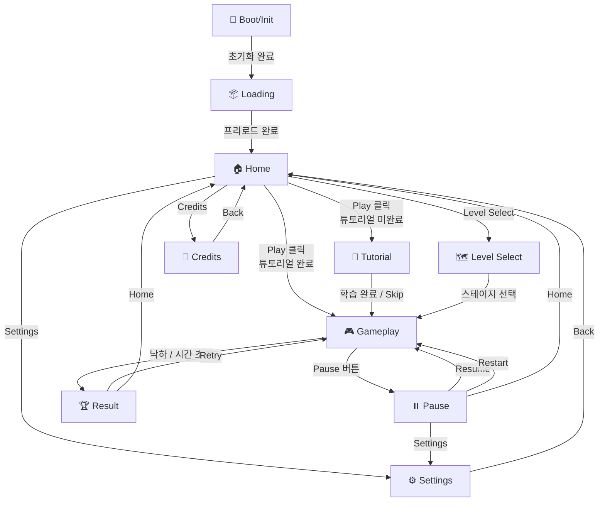

# 씬(Scene) 시스템 및 게임 플로우 구현 계획서

> **프로젝트**: Infinite Stairs (Vibe Coding)
> **작성일**: 2026-02-18
> **기반**: PRD Task 3 – 씬 시스템 및 게임 플로우

---

## 목차

1. [씬 라우팅 시스템 설계](#1-씬-라우팅-시스템-설계)
2. [각 씬별 상세 구현 계획](#2-각-씬별-상세-구현-계획)
3. [씬 전환 애니메이션/트랜지션 전략](#3-씬-전환-애니메이션트랜지션-전략)
4. [씬 간 데이터 전달 방법](#4-씬-간-데이터-전달-방법)
5. [게임 플로우 상태 머신](#5-게임-플로우-상태-머신)
6. [각 씬별 코드 스켈레톤 예시](#6-각-씬별-코드-스켈레톤-예시)

---

## 1. 씬 라우팅 시스템 설계

### 1.1 설계 원칙

본 프로젝트는 **SPA 게임**이므로 URL 기반 라우팅(React Router)이 불필요하다. 대신 **React 상태 기반 씬 전환**을 채택하여 다음 이점을 확보한다.

- 브라우저 히스토리 오염 없음
- 씬 전환 시 불필요한 마운트/언마운트 최소화
- 게임 루프와 자연스럽게 통합
- 번들 크기 절감 (react-router 의존성 제거)

### 1.2 SceneState 열거형

```typescript
// types/scene.ts

/** 게임 내 모든 씬을 정의하는 열거형 */
export enum SceneState {
  /** 초기 부팅 — 디바이스/해상도/오디오 초기화 */
  Boot = "BOOT",

  /** 에셋 프리로딩 — 텍스처, 사운드, 폰트 등 */
  Loading = "LOADING",

  /** 타이틀/홈 화면 — 메인 메뉴 */
  Home = "HOME",

  /** 튜토리얼 — 조작 학습 (선택적) */
  Tutorial = "TUTORIAL",

  /** 모드/레벨 선택 (선택적) */
  LevelSelect = "LEVEL_SELECT",

  /** 게임 플레이 — 핵심 루프 */
  Gameplay = "GAMEPLAY",

  /** 일시 정지 오버레이 */
  Pause = "PAUSE",

  /** 결과/게임오버 화면 */
  Result = "RESULT",

  /** 설정 화면 */
  Settings = "SETTINGS",

  /** 크레딧/라이선스 화면 */
  Credits = "CREDITS",
}
```

### 1.3 Zustand Store에서 씬 관리

```typescript
// store/useGameStore.ts
import { create } from "zustand";
import { SceneState } from "../types/scene";

interface SceneSlice {
  /** 현재 활성 씬 */
  currentScene: SceneState;

  /** 직전 씬 (뒤로가기/복원용) */
  previousScene: SceneState | null;

  /** 씬 전환 중 여부 (트랜지션 애니메이션 제어) */
  isTransitioning: boolean;

  /** 씬 전환 함수 */
  setScene: (next: SceneState) => void;

  /** 이전 씬으로 복귀 */
  goBack: () => void;
}

interface GameplaySlice {
  score: number;
  highScore: number;
  currentLevel: number;
  isPaused: boolean;
  isGameOver: boolean;
  setScore: (score: number) => void;
  setHighScore: (score: number) => void;
  setCurrentLevel: (level: number) => void;
  setPaused: (paused: boolean) => void;
  setGameOver: (gameOver: boolean) => void;
  resetGameplay: () => void;
}

interface SettingsSlice {
  soundEnabled: boolean;
  vibrationEnabled: boolean;
  lowPerformanceMode: boolean;
  tutorialCompleted: boolean;
  toggleSound: () => void;
  toggleVibration: () => void;
  toggleLowPerformanceMode: () => void;
  setTutorialCompleted: (completed: boolean) => void;
}

export type GameStore = SceneSlice & GameplaySlice & SettingsSlice;

export const useGameStore = create<GameStore>((set, get) => ({
  // ─── Scene Slice ───
  currentScene: SceneState.Boot,
  previousScene: null,
  isTransitioning: false,

  setScene: (next) => {
    const current = get().currentScene;
    if (current === next) return;

    set({ isTransitioning: true });

    // 트랜지션 지속 시간 후 실제 씬 변경
    setTimeout(() => {
      set({
        currentScene: next,
        previousScene: current,
        isTransitioning: false,
      });
    }, 300); // TRANSITION_DURATION_MS
  },

  goBack: () => {
    const prev = get().previousScene;
    if (prev) {
      get().setScene(prev);
    }
  },

  // ─── Gameplay Slice ───
  score: 0,
  highScore: 0,
  currentLevel: 1,
  isPaused: false,
  isGameOver: false,

  setScore: (score) => set({ score }),
  setHighScore: (score) => set({ highScore: score }),
  setCurrentLevel: (level) => set({ currentLevel: level }),
  setPaused: (paused) => set({ isPaused: paused }),
  setGameOver: (gameOver) => set({ isGameOver: gameOver }),

  resetGameplay: () =>
    set({
      score: 0,
      isPaused: false,
      isGameOver: false,
    }),

  // ─── Settings Slice ───
  soundEnabled: true,
  vibrationEnabled: true,
  lowPerformanceMode: false,
  tutorialCompleted: false,

  toggleSound: () => set((s) => ({ soundEnabled: !s.soundEnabled })),
  toggleVibration: () => set((s) => ({ vibrationEnabled: !s.vibrationEnabled })),
  toggleLowPerformanceMode: () =>
    set((s) => ({ lowPerformanceMode: !s.lowPerformanceMode })),
  setTutorialCompleted: (completed) => set({ tutorialCompleted: completed }),
}));
```

### 1.4 씬 전환 규칙 매트릭스

| 출발 씬 | 이동 가능 대상 | 트리거 |
|---------|---------------|--------|
| Boot | Loading | 초기화 완료 시 자동 |
| Loading | Home | 프리로드 완료 시 자동 |
| Home | Tutorial, LevelSelect, Gameplay, Settings, Credits | 버튼 클릭 |
| Tutorial | Gameplay | 튜토리얼 완료 |
| LevelSelect | Gameplay | 스테이지 선택 |
| Gameplay | Pause, Result | Pause 버튼 / Win·Fail 조건 |
| Pause | Gameplay, Home, Settings | Resume / Home / Settings 버튼 |
| Result | Gameplay, Home | Retry / Home 버튼 |
| Settings | Home (또는 이전 씬) | Back 버튼 |
| Credits | Home | Back 버튼 |

---

## 2. 각 씬별 상세 구현 계획

### 2.1 Boot/Init 씬

**목적**: 게임 실행에 필요한 최소한의 시스템 초기화를 수행한다.

**수행 항목:**

| 항목 | 설명 | 비고 |
|------|------|------|
| 해상도 초기화 | `devicePixelRatio` 감지 및 Canvas 크기 설정 | ResizeObserver 연동 |
| 입력 시스템 초기화 | 터치/키보드/마우스 이벤트 리스너 등록 | Passive 이벤트 사용 |
| 오디오 컨텍스트 | AudioContext 생성 (사용자 제스처 대기) | iOS Safari 대응 |
| 저장 데이터 로딩 | localStorage에서 설정/최고기록 복원 | JSON 파싱 에러 핸들링 |
| 디바이스 체크 | GPU 성능, 메모리, 터치 지원 여부 판별 | 저사양 모드 자동 전환 |
| FPS 목표 설정 | 디바이스 성능에 따라 30fps/60fps 결정 | requestAnimationFrame 기반 |
| Safe-area 계산 | `env(safe-area-inset-*)` 값 캐싱 | 노치/홀 디스플레이 대응 |

```typescript
// scenes/BootScene.tsx
import { useEffect } from "react";
import { useGameStore } from "../store/useGameStore";
import { SceneState } from "../types/scene";

/** 디바이스 성능 정보 */
interface DeviceProfile {
  isMobile: boolean;
  hasTouchSupport: boolean;
  devicePixelRatio: number;
  isLowEnd: boolean;
  safeAreaInsets: {
    top: number;
    bottom: number;
    left: number;
    right: number;
  };
}

/** 디바이스 프로파일링 */
function detectDeviceProfile(): DeviceProfile {
  const isMobile = /Android|iPhone|iPad|iPod/i.test(navigator.userAgent);
  const hasTouchSupport = "ontouchstart" in window || navigator.maxTouchPoints > 0;
  const dpr = Math.min(window.devicePixelRatio || 1, 2); // 최대 2x로 제한

  // 간단한 저사양 판별 (하드웨어 동시성 기반)
  const hardwareConcurrency = navigator.hardwareConcurrency || 2;
  const isLowEnd = hardwareConcurrency <= 2 || (isMobile && dpr <= 1);

  // Safe-area 인셋 파싱
  const computedStyle = getComputedStyle(document.documentElement);
  const safeAreaInsets = {
    top: parseInt(computedStyle.getPropertyValue("--sat") || "0", 10),
    bottom: parseInt(computedStyle.getPropertyValue("--sab") || "0", 10),
    left: parseInt(computedStyle.getPropertyValue("--sal") || "0", 10),
    right: parseInt(computedStyle.getPropertyValue("--sar") || "0", 10),
  };

  return { isMobile, hasTouchSupport, devicePixelRatio: dpr, isLowEnd, safeAreaInsets };
}

/** localStorage에서 저장 데이터 복원 */
function loadSavedData(): { highScore: number; tutorialCompleted: boolean } {
  try {
    const raw = localStorage.getItem("infinite-stairs-save");
    if (!raw) return { highScore: 0, tutorialCompleted: false };
    const data = JSON.parse(raw);
    return {
      highScore: typeof data.highScore === "number" ? data.highScore : 0,
      tutorialCompleted: !!data.tutorialCompleted,
    };
  } catch {
    console.warn("[Boot] 저장 데이터 파싱 실패, 초기값 사용");
    return { highScore: 0, tutorialCompleted: false };
  }
}

export function BootScene() {
  const setScene = useGameStore((s) => s.setScene);
  const setHighScore = useGameStore((s) => s.setHighScore);
  const setTutorialCompleted = useGameStore((s) => s.setTutorialCompleted);
  const toggleLowPerformanceMode = useGameStore((s) => s.toggleLowPerformanceMode);

  useEffect(() => {
    async function init() {
      // 1. 디바이스 프로파일링
      const profile = detectDeviceProfile();
      console.log("[Boot] Device profile:", profile);

      if (profile.isLowEnd) {
        toggleLowPerformanceMode();
      }

      // 2. 저장 데이터 복원
      const saved = loadSavedData();
      setHighScore(saved.highScore);
      setTutorialCompleted(saved.tutorialCompleted);

      // 3. CSS Safe-area 변수 설정
      const root = document.documentElement;
      root.style.setProperty("--sat", `env(safe-area-inset-top)`);
      root.style.setProperty("--sab", `env(safe-area-inset-bottom)`);
      root.style.setProperty("--sal", `env(safe-area-inset-left)`);
      root.style.setProperty("--sar", `env(safe-area-inset-right)`);

      // 4. 초기화 완료 → Loading 씬으로 전환
      setScene(SceneState.Loading);
    }

    init();
  }, [setScene, setHighScore, setTutorialCompleted, toggleLowPerformanceMode]);

  return (
    <div className="scene scene--boot">
      <p>Initializing...</p>
    </div>
  );
}
```

### 2.2 Preload/Loading 씬

**목적**: 게임에 필요한 에셋(텍스처, 사운드, 폰트 등)을 미리 로딩한다.

**수행 항목:**

- 텍스처 아틀라스/스프라이트시트 프리로드
- 사운드 파일 디코딩
- 커스텀 폰트 로딩 (`document.fonts.ready`)
- 로딩 진행률 표시 (프로그레스바)
- 팁 문구 로테이션 표시

```typescript
// scenes/LoadingScene.tsx
import { useEffect, useState } from "react";
import { useGameStore } from "../store/useGameStore";
import { SceneState } from "../types/scene";

/** 로딩할 에셋 매니페스트 */
interface AssetManifest {
  textures: string[];
  sounds: string[];
  fonts: string[];
}

const ASSET_MANIFEST: AssetManifest = {
  textures: [
    "/assets/sprites/character-atlas.png",
    "/assets/sprites/stairs-atlas.png",
    "/assets/backgrounds/bg-layer1.png",
    "/assets/backgrounds/bg-layer2.png",
  ],
  sounds: [
    "/assets/audio/bgm-main.mp3",
    "/assets/audio/sfx-jump.wav",
    "/assets/audio/sfx-land.wav",
    "/assets/audio/sfx-gameover.wav",
  ],
  fonts: ["GameFont"],
};

const TIPS = [
  "타이밍에 맞춰 터치하면 콤보 점수를 획득할 수 있어요!",
  "특수 계단은 밟기 전에 잘 확인하세요.",
  "연속 점프로 더 높은 점수를 노려보세요!",
  "설정에서 진동을 끌 수 있어요.",
];

/** 이미지 하나를 로드하는 Promise */
function loadImage(src: string): Promise<HTMLImageElement> {
  return new Promise((resolve, reject) => {
    const img = new Image();
    img.onload = () => resolve(img);
    img.onerror = reject;
    img.src = src;
  });
}

/** 오디오 파일 하나를 페치하는 Promise */
async function loadAudio(src: string): Promise<AudioBuffer | null> {
  try {
    const response = await fetch(src);
    const arrayBuffer = await response.arrayBuffer();
    // AudioContext는 사용자 제스처 후 생성되므로 여기선 raw buffer만 캐싱
    return null; // 실제 구현에서는 AudioContext.decodeAudioData 사용
  } catch (err) {
    console.warn(`[Loading] 오디오 로드 실패: ${src}`, err);
    return null;
  }
}

export function LoadingScene() {
  const setScene = useGameStore((s) => s.setScene);
  const [progress, setProgress] = useState(0);
  const [tipIndex, setTipIndex] = useState(0);

  // 팁 로테이션
  useEffect(() => {
    const interval = setInterval(() => {
      setTipIndex((prev) => (prev + 1) % TIPS.length);
    }, 3000);
    return () => clearInterval(interval);
  }, []);

  // 에셋 프리로드
  useEffect(() => {
    async function preload() {
      const totalAssets =
        ASSET_MANIFEST.textures.length +
        ASSET_MANIFEST.sounds.length +
        ASSET_MANIFEST.fonts.length;
      let loaded = 0;

      const updateProgress = () => {
        loaded++;
        setProgress(Math.round((loaded / totalAssets) * 100));
      };

      // 텍스처 로드
      const texturePromises = ASSET_MANIFEST.textures.map(async (src) => {
        await loadImage(src);
        updateProgress();
      });

      // 사운드 로드
      const soundPromises = ASSET_MANIFEST.sounds.map(async (src) => {
        await loadAudio(src);
        updateProgress();
      });

      // 폰트 로드
      const fontPromises = ASSET_MANIFEST.fonts.map(async (fontFamily) => {
        try {
          await document.fonts.load(`16px "${fontFamily}"`);
        } catch {
          console.warn(`[Loading] 폰트 로드 실패: ${fontFamily}`);
        }
        updateProgress();
      });

      await Promise.allSettled([
        ...texturePromises,
        ...soundPromises,
        ...fontPromises,
      ]);

      // 최소 로딩 시간 보장 (UX용)
      await new Promise((r) => setTimeout(r, 500));

      setScene(SceneState.Home);
    }

    preload();
  }, [setScene]);

  return (
    <div className="scene scene--loading">
      <div className="loading-content">
        <h2>Loading...</h2>

        {/* 프로그레스바 */}
        <div className="progress-bar">
          <div
            className="progress-bar__fill"
            style={{ width: `${progress}%` }}
          />
        </div>
        <span className="progress-bar__text">{progress}%</span>

        {/* 팁 문구 */}
        <p className="loading-tip">{TIPS[tipIndex]}</p>
      </div>
    </div>
  );
}
```

### 2.3 Title/Home 씬

**목적**: 게임의 메인 메뉴 역할. 플레이어가 게임을 시작하거나 설정/크레딧에 접근한다.

**UI 구성 요소:**

| 요소 | 설명 | 액션 |
|------|------|------|
| 게임 로고 | 타이틀 이미지/텍스트 | - |
| Play 버튼 | 게임 시작 | → Tutorial 또는 Gameplay |
| Settings 버튼 | 설정 화면 | → Settings |
| Credits 버튼 | 크레딧/라이선스 | → Credits |
| 최고 기록 표시 | `highScore` 값 | 읽기 전용 |
| 사운드 토글 | 음소거 아이콘 | `toggleSound()` |

```typescript
// scenes/HomeScene.tsx
import { useGameStore } from "../store/useGameStore";
import { SceneState } from "../types/scene";

export function HomeScene() {
  const setScene = useGameStore((s) => s.setScene);
  const highScore = useGameStore((s) => s.highScore);
  const soundEnabled = useGameStore((s) => s.soundEnabled);
  const toggleSound = useGameStore((s) => s.toggleSound);
  const tutorialCompleted = useGameStore((s) => s.tutorialCompleted);

  const handlePlay = () => {
    if (!tutorialCompleted) {
      setScene(SceneState.Tutorial);
    } else {
      setScene(SceneState.Gameplay);
    }
  };

  return (
    <div className="scene scene--home">
      {/* 게임 로고 */}
      <div className="home-logo">
        <h1>Infinite Stairs</h1>
      </div>

      {/* 최고 기록 */}
      <div className="home-high-score">
        <span>Best: {highScore.toLocaleString()}</span>
      </div>

      {/* 메뉴 버튼 */}
      <div className="home-menu">
        <button className="btn btn--primary" onClick={handlePlay}>
          Play
        </button>
        <button
          className="btn btn--secondary"
          onClick={() => setScene(SceneState.Settings)}
        >
          Settings
        </button>
        <button
          className="btn btn--secondary"
          onClick={() => setScene(SceneState.Credits)}
        >
          Credits
        </button>
      </div>

      {/* 사운드 토글 */}
      <button
        className="btn-icon btn-icon--sound"
        onClick={toggleSound}
        aria-label={soundEnabled ? "사운드 끄기" : "사운드 켜기"}
      >
        {soundEnabled ? "🔊" : "🔇"}
      </button>
    </div>
  );
}
```

### 2.4 Tutorial 씬 (선택적)

**목적**: 첫 플레이어에게 기본 조작을 안내한다.

**설계 요점:**

- 단계별 가이드 (3~5단계)
- 실제 게임 메커닉을 간소화한 인터랙티브 학습
- "다시 보지 않기" 옵션 (localStorage 저장)
- 건너뛰기(Skip) 버튼 항상 노출

```typescript
// scenes/TutorialScene.tsx
import { useState } from "react";
import { useGameStore } from "../store/useGameStore";
import { SceneState } from "../types/scene";

interface TutorialStep {
  title: string;
  description: string;
  action: string; // 사용자에게 요구하는 동작 설명
}

const TUTORIAL_STEPS: TutorialStep[] = [
  {
    title: "좌우 이동",
    description: "화면 왼쪽/오른쪽을 터치하여 캐릭터를 이동시키세요.",
    action: "화면을 터치해 보세요!",
  },
  {
    title: "타이밍 점프",
    description: "계단이 나타나는 타이밍에 맞춰 터치하면 점프합니다.",
    action: "계단 위에서 터치하세요!",
  },
  {
    title: "콤보 시스템",
    description: "연속으로 정확한 타이밍에 착지하면 콤보 보너스를 획득합니다.",
    action: "3번 연속 성공해 보세요!",
  },
];

export function TutorialScene() {
  const setScene = useGameStore((s) => s.setScene);
  const setTutorialCompleted = useGameStore((s) => s.setTutorialCompleted);
  const [currentStep, setCurrentStep] = useState(0);

  const handleComplete = () => {
    setTutorialCompleted(true);

    // localStorage에 저장
    try {
      const saved = JSON.parse(localStorage.getItem("infinite-stairs-save") || "{}");
      saved.tutorialCompleted = true;
      localStorage.setItem("infinite-stairs-save", JSON.stringify(saved));
    } catch {
      /* ignore */
    }

    setScene(SceneState.Gameplay);
  };

  const handleSkip = () => {
    handleComplete();
  };

  const handleNext = () => {
    if (currentStep < TUTORIAL_STEPS.length - 1) {
      setCurrentStep((prev) => prev + 1);
    } else {
      handleComplete();
    }
  };

  const step = TUTORIAL_STEPS[currentStep];

  return (
    <div className="scene scene--tutorial">
      {/* 건너뛰기 버튼 */}
      <button className="btn-skip" onClick={handleSkip}>
        Skip
      </button>

      {/* 진행 표시 */}
      <div className="tutorial-progress">
        {TUTORIAL_STEPS.map((_, idx) => (
          <div
            key={idx}
            className={`tutorial-dot ${idx <= currentStep ? "active" : ""}`}
          />
        ))}
      </div>

      {/* 현재 단계 */}
      <div className="tutorial-content">
        <h2>{step.title}</h2>
        <p>{step.description}</p>
        <p className="tutorial-action">{step.action}</p>
      </div>

      <button className="btn btn--primary" onClick={handleNext}>
        {currentStep < TUTORIAL_STEPS.length - 1 ? "다음" : "시작!"}
      </button>
    </div>
  );
}
```

### 2.5 Mode/Level Select 씬 (선택적)

**목적**: 여러 스테이지나 모드가 있는 경우, 플레이어가 원하는 스테이지를 선택한다.

**UI 구성 요소:**

- 스테이지 카드 (썸네일 + 이름 + 별점)
- 잠금/해금 상태 표시
- 스크롤 또는 스와이프 네비게이션

```typescript
// scenes/LevelSelectScene.tsx
import { useGameStore } from "../store/useGameStore";
import { SceneState } from "../types/scene";

interface LevelInfo {
  id: number;
  name: string;
  thumbnail: string;
  stars: number; // 0~3
  unlocked: boolean;
  requiredScore: number;
}

const LEVELS: LevelInfo[] = [
  { id: 1, name: "기본 계단", thumbnail: "/assets/levels/level1.png", stars: 0, unlocked: true, requiredScore: 0 },
  { id: 2, name: "눈 내리는 계단", thumbnail: "/assets/levels/level2.png", stars: 0, unlocked: false, requiredScore: 500 },
  { id: 3, name: "용암 계단", thumbnail: "/assets/levels/level3.png", stars: 0, unlocked: false, requiredScore: 1500 },
];

export function LevelSelectScene() {
  const setScene = useGameStore((s) => s.setScene);
  const setCurrentLevel = useGameStore((s) => s.setCurrentLevel);
  const highScore = useGameStore((s) => s.highScore);

  const handleSelectLevel = (level: LevelInfo) => {
    if (!level.unlocked && highScore < level.requiredScore) return;
    setCurrentLevel(level.id);
    setScene(SceneState.Gameplay);
  };

  return (
    <div className="scene scene--level-select">
      <h2>스테이지 선택</h2>

      <div className="level-grid">
        {LEVELS.map((level) => {
          const isUnlocked = level.unlocked || highScore >= level.requiredScore;
          return (
            <button
              key={level.id}
              className={`level-card ${isUnlocked ? "" : "locked"}`}
              onClick={() => handleSelectLevel({ ...level, unlocked: isUnlocked })}
              disabled={!isUnlocked}
            >
              
              <span className="level-card__name">{level.name}</span>

              {/* 별점 */}
              <div className="level-card__stars">
                {[1, 2, 3].map((star) => (
                  <span key={star} className={star <= level.stars ? "star filled" : "star"}>
                    ★
                  </span>
                ))}
              </div>

              {/* 잠금 오버레이 */}
              {!isUnlocked && (
                <div className="level-card__lock">
                  🔒 {level.requiredScore.toLocaleString()}점 필요
                </div>
              )}
            </button>
          );
        })}
      </div>

      <button className="btn btn--back" onClick={() => setScene(SceneState.Home)}>
        돌아가기
      </button>
    </div>
  );
}
```

### 2.6 Gameplay 씬

**목적**: 게임의 핵심 루프가 동작하는 씬. 물리 시뮬레이션, 입력 처리, HUD, 결과 판정이 이루어진다.

**핵심 구성:**

| 구성 요소 | 설명 |
|-----------|------|
| 물리 시뮬레이션 | Matter.js/Rapier 월드 업데이트 |
| 입력 시스템 | 터치/키보드 이벤트 → 게임 액션 변환 |
| HUD | 점수, 콤보, 남은 시간 등 오버레이 |
| 계단 생성기 | 무한 스크롤 계단 생성/재활용 |
| 결과 조건 | 낙하 감지, 시간 초과, 목표 달성 |
| Debug 토글 | 개발 중 충돌 박스/FPS 표시 (DEV only) |

```typescript
// scenes/GameplayScene.tsx
import { useEffect, useRef, useCallback } from "react";
import { useGameStore } from "../store/useGameStore";
import { SceneState } from "../types/scene";

/** 게임 루프에서 사용하는 게임 상태 (React 렌더와 분리) */
interface GameLoopState {
  score: number;
  combo: number;
  elapsed: number;
  isRunning: boolean;
}

export function GameplayScene() {
  const setScene = useGameStore((s) => s.setScene);
  const setScore = useGameStore((s) => s.setScore);
  const setHighScore = useGameStore((s) => s.setHighScore);
  const setGameOver = useGameStore((s) => s.setGameOver);
  const setPaused = useGameStore((s) => s.setPaused);
  const highScore = useGameStore((s) => s.highScore);
  const isPaused = useGameStore((s) => s.isPaused);

  const canvasRef = useRef<HTMLCanvasElement>(null);
  const gameStateRef = useRef<GameLoopState>({
    score: 0,
    combo: 0,
    elapsed: 0,
    isRunning: true,
  });
  const rafIdRef = useRef<number>(0);

  // ─── 게임 루프 ───
  const gameLoop = useCallback(
    (timestamp: number) => {
      const state = gameStateRef.current;
      if (!state.isRunning) return;

      const canvas = canvasRef.current;
      if (!canvas) return;
      const ctx = canvas.getContext("2d");
      if (!ctx) return;

      // 1. 물리 업데이트 (여기서 Matter.js/Rapier 월드 스텝 호출)
      // physicsEngine.step(deltaTime);

      // 2. 게임 로직 업데이트
      // updateStairs(), updateCharacter(), checkCollision() 등

      // 3. 렌더링
      ctx.clearRect(0, 0, canvas.width, canvas.height);
      // renderBackground(ctx);
      // renderStairs(ctx);
      // renderCharacter(ctx);
      // renderHUD(ctx, state);

      // 4. 결과 조건 체크
      // if (characterFallen()) { handleGameOver(); return; }

      // 5. 다음 프레임 예약
      rafIdRef.current = requestAnimationFrame(gameLoop);
    },
    []
  );

  // ─── 게임 시작/종료 ───
  useEffect(() => {
    gameStateRef.current = { score: 0, combo: 0, elapsed: 0, isRunning: true };
    rafIdRef.current = requestAnimationFrame(gameLoop);

    return () => {
      cancelAnimationFrame(rafIdRef.current);
      gameStateRef.current.isRunning = false;
    };
  }, [gameLoop]);

  // ─── 일시정지 반영 ───
  useEffect(() => {
    gameStateRef.current.isRunning = !isPaused;
    if (!isPaused) {
      rafIdRef.current = requestAnimationFrame(gameLoop);
    }
  }, [isPaused, gameLoop]);

  // ─── 입력 핸들러 ───
  const handleInput = useCallback((direction: "left" | "right") => {
    if (gameStateRef.current.isRunning) {
      // 캐릭터 이동 + 점프 로직
      console.log(`[Gameplay] Input: ${direction}`);
    }
  }, []);

  // ─── 게임 오버 처리 ───
  const handleGameOver = useCallback(() => {
    gameStateRef.current.isRunning = false;
    cancelAnimationFrame(rafIdRef.current);

    const finalScore = gameStateRef.current.score;
    setScore(finalScore);
    setGameOver(true);

    // 최고 기록 갱신
    if (finalScore > highScore) {
      setHighScore(finalScore);
      try {
        const saved = JSON.parse(localStorage.getItem("infinite-stairs-save") || "{}");
        saved.highScore = finalScore;
        localStorage.setItem("infinite-stairs-save", JSON.stringify(saved));
      } catch {
        /* ignore */
      }
    }

    setScene(SceneState.Result);
  }, [highScore, setScene, setScore, setHighScore, setGameOver]);

  // ─── 일시정지 ───
  const handlePause = useCallback(() => {
    setPaused(true);
    setScene(SceneState.Pause);
  }, [setPaused, setScene]);

  return (
    <div className="scene scene--gameplay">
      {/* 게임 캔버스 */}
      <canvas ref={canvasRef} className="game-canvas" />

      {/* HUD 오버레이 */}
      <div className="hud">
        <div className="hud__score">
          Score: {gameStateRef.current.score}
        </div>
        <div className="hud__combo">
          Combo: x{gameStateRef.current.combo}
        </div>
        <button className="hud__pause" onClick={handlePause}>
          ⏸
        </button>
      </div>

      {/* 터치 입력 영역 */}
      <div className="touch-areas">
        <div
          className="touch-area touch-area--left"
          onPointerDown={() => handleInput("left")}
        />
        <div
          className="touch-area touch-area--right"
          onPointerDown={() => handleInput("right")}
        />
      </div>

      {/* Debug 토글 (개발 모드에서만 표시) */}
      {import.meta.env.DEV && (
        <div className="debug-panel">
          <label>
            <input type="checkbox" /> Collision Box
          </label>
          <label>
            <input type="checkbox" /> FPS Counter
          </label>
        </div>
      )}
    </div>
  );
}
```

### 2.7 Pause Overlay 씬

**목적**: 게임 진행 중 일시 정지 상태를 처리하는 오버레이.

**기능:**

- Resume (게임 재개)
- Restart (처음부터 다시)
- Settings Quick (간이 설정)
- Home (홈으로 복귀)
- 물리 시뮬레이션 일시 정지

```typescript
// scenes/PauseScene.tsx
import { useGameStore } from "../store/useGameStore";
import { SceneState } from "../types/scene";

export function PauseScene() {
  const setScene = useGameStore((s) => s.setScene);
  const setPaused = useGameStore((s) => s.setPaused);
  const resetGameplay = useGameStore((s) => s.resetGameplay);
  const soundEnabled = useGameStore((s) => s.soundEnabled);
  const toggleSound = useGameStore((s) => s.toggleSound);
  const vibrationEnabled = useGameStore((s) => s.vibrationEnabled);
  const toggleVibration = useGameStore((s) => s.toggleVibration);

  const handleResume = () => {
    setPaused(false);
    setScene(SceneState.Gameplay);
  };

  const handleRestart = () => {
    resetGameplay();
    setPaused(false);
    setScene(SceneState.Gameplay);
  };

  const handleHome = () => {
    resetGameplay();
    setPaused(false);
    setScene(SceneState.Home);
  };

  return (
    <div className="scene scene--pause overlay">
      <div className="pause-panel">
        <h2>일시 정지</h2>

        <div className="pause-buttons">
          <button className="btn btn--primary" onClick={handleResume}>
            Resume
          </button>
          <button className="btn btn--secondary" onClick={handleRestart}>
            Restart
          </button>
          <button className="btn btn--secondary" onClick={handleHome}>
            Home
          </button>
        </div>

        {/* 간이 설정 */}
        <div className="pause-quick-settings">
          <label>
            <input
              type="checkbox"
              checked={soundEnabled}
              onChange={toggleSound}
            />
            사운드
          </label>
          <label>
            <input
              type="checkbox"
              checked={vibrationEnabled}
              onChange={toggleVibration}
            />
            진동
          </label>
        </div>
      </div>
    </div>
  );
}
```

### 2.8 Result/Game Over 씬

**목적**: 게임 종료 후 결과를 표시하고 다음 행동을 선택한다.

**표시 항목:**

- 최종 점수
- 최고 기록 갱신 여부
- 도달 높이/층수
- 최대 콤보
- Replay 영상 (선택적, 향후 구현)

```typescript
// scenes/ResultScene.tsx
import { useGameStore } from "../store/useGameStore";
import { SceneState } from "../types/scene";

export function ResultScene() {
  const setScene = useGameStore((s) => s.setScene);
  const resetGameplay = useGameStore((s) => s.resetGameplay);
  const score = useGameStore((s) => s.score);
  const highScore = useGameStore((s) => s.highScore);

  const isNewRecord = score >= highScore && score > 0;

  const handleRetry = () => {
    resetGameplay();
    setScene(SceneState.Gameplay);
  };

  const handleHome = () => {
    resetGameplay();
    setScene(SceneState.Home);
  };

  return (
    <div className="scene scene--result">
      <div className="result-panel">
        {isNewRecord && <div className="result-new-record">NEW RECORD!</div>}

        <h2>Game Over</h2>

        <div className="result-stats">
          <div className="stat">
            <span className="stat__label">Score</span>
            <span className="stat__value">{score.toLocaleString()}</span>
          </div>
          <div className="stat">
            <span className="stat__label">Best</span>
            <span className="stat__value">{highScore.toLocaleString()}</span>
          </div>
        </div>

        <div className="result-actions">
          <button className="btn btn--primary" onClick={handleRetry}>
            다시하기
          </button>
          <button className="btn btn--secondary" onClick={handleHome}>
            홈으로
          </button>
        </div>
      </div>
    </div>
  );
}
```

### 2.9 Settings 씬

**목적**: 사운드, 진동, 저사양 모드 등 사용자 설정을 관리한다.

```typescript
// scenes/SettingsScene.tsx
import { useGameStore } from "../store/useGameStore";
import { SceneState } from "../types/scene";

export function SettingsScene() {
  const setScene = useGameStore((s) => s.setScene);
  const goBack = useGameStore((s) => s.goBack);
  const soundEnabled = useGameStore((s) => s.soundEnabled);
  const toggleSound = useGameStore((s) => s.toggleSound);
  const vibrationEnabled = useGameStore((s) => s.vibrationEnabled);
  const toggleVibration = useGameStore((s) => s.toggleVibration);
  const lowPerformanceMode = useGameStore((s) => s.lowPerformanceMode);
  const toggleLowPerformanceMode = useGameStore((s) => s.toggleLowPerformanceMode);

  const handleBack = () => {
    // 설정 변경사항을 localStorage에 저장
    try {
      const saved = JSON.parse(localStorage.getItem("infinite-stairs-save") || "{}");
      saved.settings = { soundEnabled, vibrationEnabled, lowPerformanceMode };
      localStorage.setItem("infinite-stairs-save", JSON.stringify(saved));
    } catch {
      /* ignore */
    }

    goBack();
  };

  return (
    <div className="scene scene--settings">
      <h2>설정</h2>

      <div className="settings-list">
        <div className="setting-item">
          <span>사운드</span>
          <button
            className={`toggle ${soundEnabled ? "on" : "off"}`}
            onClick={toggleSound}
          >
            {soundEnabled ? "ON" : "OFF"}
          </button>
        </div>

        <div className="setting-item">
          <span>진동</span>
          <button
            className={`toggle ${vibrationEnabled ? "on" : "off"}`}
            onClick={toggleVibration}
          >
            {vibrationEnabled ? "ON" : "OFF"}
          </button>
        </div>

        <div className="setting-item">
          <span>저사양 모드</span>
          <button
            className={`toggle ${lowPerformanceMode ? "on" : "off"}`}
            onClick={toggleLowPerformanceMode}
          >
            {lowPerformanceMode ? "ON" : "OFF"}
          </button>
        </div>
      </div>

      <button className="btn btn--back" onClick={handleBack}>
        돌아가기
      </button>
    </div>
  );
}
```

### 2.10 Credits/Licenses 씬

**목적**: 사용된 에셋, 오픈소스 라이브러리, 라이선스 정보를 고지한다.

```typescript
// scenes/CreditsScene.tsx
import { useGameStore } from "../store/useGameStore";
import { SceneState } from "../types/scene";

interface CreditEntry {
  category: string;
  items: {
    name: string;
    author: string;
    license: string;
    url?: string;
  }[];
}

const CREDITS: CreditEntry[] = [
  {
    category: "게임 엔진 / 물리",
    items: [
      { name: "Matter.js", author: "liabru", license: "MIT", url: "https://brm.io/matter-js/" },
      { name: "React", author: "Meta", license: "MIT", url: "https://react.dev" },
      { name: "Zustand", author: "pmndrs", license: "MIT", url: "https://github.com/pmndrs/zustand" },
    ],
  },
  {
    category: "에셋",
    items: [
      { name: "캐릭터 스프라이트", author: "작성자명", license: "CC BY 4.0" },
      { name: "배경 타일셋", author: "작성자명", license: "CC0" },
      { name: "BGM", author: "작성자명", license: "CC BY 4.0" },
      { name: "효과음", author: "작성자명", license: "CC0" },
    ],
  },
  {
    category: "폰트",
    items: [
      { name: "게임 폰트", author: "작성자명", license: "OFL" },
    ],
  },
];

export function CreditsScene() {
  const setScene = useGameStore((s) => s.setScene);

  return (
    <div className="scene scene--credits">
      <h2>Credits & Licenses</h2>

      <div className="credits-scroll">
        {CREDITS.map((section) => (
          <div key={section.category} className="credits-section">
            <h3>{section.category}</h3>
            <ul>
              {section.items.map((item) => (
                <li key={item.name}>
                  <strong>{item.name}</strong> by {item.author}
                  <br />
                  <span className="license-badge">{item.license}</span>
                  {item.url && (
                    <a href={item.url} target="_blank" rel="noopener noreferrer">
                      {" "}↗
                    </a>
                  )}
                </li>
              ))}
            </ul>
          </div>
        ))}
      </div>

      <button className="btn btn--back" onClick={() => setScene(SceneState.Home)}>
        돌아가기
      </button>
    </div>
  );
}
```

---

## 3. 씬 전환 애니메이션/트랜지션 전략

### 3.1 트랜지션 방식

| 방식 | 설명 | 적합한 상황 |
|------|------|------------|
| CSS Fade | `opacity` 0→1 트랜지션 | 대부분의 씬 전환 |
| Canvas Fade | Canvas 위에 검정 사각형 alpha 조정 | Gameplay ↔ Result |
| Slide | 슬라이드 인/아웃 | Settings, Credits |
| None | 즉시 전환 | Pause 오버레이 |

### 3.2 트랜지션 설정값

```typescript
// config/transition.ts

export const TRANSITION_CONFIG = {
  /** 기본 페이드 지속 시간 (ms) */
  FADE_DURATION: 300,

  /** 씬별 트랜지션 오버라이드 */
  SCENE_TRANSITIONS: {
    BOOT_TO_LOADING: { type: "none" as const, duration: 0 },
    LOADING_TO_HOME: { type: "fade" as const, duration: 500 },
    HOME_TO_GAMEPLAY: { type: "fade" as const, duration: 300 },
    GAMEPLAY_TO_PAUSE: { type: "none" as const, duration: 0 },
    GAMEPLAY_TO_RESULT: { type: "fade" as const, duration: 400 },
    ANY_TO_SETTINGS: { type: "slide" as const, duration: 250 },
    ANY_TO_CREDITS: { type: "slide" as const, duration: 250 },
  },

  /** CSS 이징 함수 */
  EASING: "ease-in-out",
} as const;

export type TransitionType = "fade" | "slide" | "none";
```

### 3.3 SceneTransition 컴포넌트

```typescript
// components/SceneTransition.tsx
import { useEffect, useState } from "react";
import { useGameStore } from "../store/useGameStore";
import { TRANSITION_CONFIG } from "../config/transition";

interface SceneTransitionProps {
  children: React.ReactNode;
}

export function SceneTransition({ children }: SceneTransitionProps) {
  const isTransitioning = useGameStore((s) => s.isTransitioning);
  const [opacity, setOpacity] = useState(1);

  useEffect(() => {
    if (isTransitioning) {
      // 페이드 아웃
      setOpacity(0);
    } else {
      // 페이드 인
      const timer = setTimeout(() => setOpacity(1), 50);
      return () => clearTimeout(timer);
    }
  }, [isTransitioning]);

  return (
    <div
      className="scene-transition-wrapper"
      style={{
        opacity,
        transition: `opacity ${TRANSITION_CONFIG.FADE_DURATION}ms ${TRANSITION_CONFIG.EASING}`,
      }}
    >
      {children}
    </div>
  );
}
```

---

## 4. 씬 간 데이터 전달 방법

### 4.1 Zustand Store를 통한 공유 상태

모든 씬 간 데이터는 **Zustand store**를 단일 진실의 원천(Single Source of Truth)으로 사용한다.

```
┌────────────┐    ┌──────────────┐    ┌────────────┐
│  HomeScene  │───▶│  useGameStore │◀───│ GameplayScene│
└────────────┘    │              │    └────────────┘
                  │  - score     │
┌────────────┐    │  - highScore │    ┌────────────┐
│ ResultScene │───▶│  - settings  │◀───│ PauseScene  │
└────────────┘    │  - scene     │    └────────────┘
                  └──────────────┘
```

### 4.2 씬 전환 이벤트 시스템

씬 전환 시 추가적인 콜백이나 사이드 이펙트가 필요한 경우, 이벤트 시스템을 사용한다.

```typescript
// events/sceneEvents.ts

type SceneEventCallback = (data?: unknown) => void;

class SceneEventEmitter {
  private listeners = new Map<string, Set<SceneEventCallback>>();

  /** 이벤트 구독 */
  on(event: string, callback: SceneEventCallback): () => void {
    if (!this.listeners.has(event)) {
      this.listeners.set(event, new Set());
    }
    this.listeners.get(event)!.add(callback);

    // unsubscribe 함수 반환
    return () => {
      this.listeners.get(event)?.delete(callback);
    };
  }

  /** 이벤트 발행 */
  emit(event: string, data?: unknown): void {
    this.listeners.get(event)?.forEach((cb) => cb(data));
  }

  /** 모든 리스너 제거 */
  clear(): void {
    this.listeners.clear();
  }
}

export const sceneEvents = new SceneEventEmitter();

// 사전 정의된 이벤트 키
export const SCENE_EVENTS = {
  GAME_START: "scene:game_start",
  GAME_OVER: "scene:game_over",
  GAME_PAUSE: "scene:game_pause",
  GAME_RESUME: "scene:game_resume",
  SCORE_UPDATE: "scene:score_update",
  NEW_HIGH_SCORE: "scene:new_high_score",
} as const;
```

### 4.3 이벤트 사용 예시

```typescript
// Gameplay 씬에서 게임 오버 시
import { sceneEvents, SCENE_EVENTS } from "../events/sceneEvents";

function onGameOver(finalScore: number) {
  sceneEvents.emit(SCENE_EVENTS.GAME_OVER, { score: finalScore });
  sceneEvents.emit(SCENE_EVENTS.SCORE_UPDATE, { score: finalScore });
}

// Result 씬에서 구독
import { useEffect } from "react";

function useGameOverListener(callback: (data: { score: number }) => void) {
  useEffect(() => {
    const unsub = sceneEvents.on(SCENE_EVENTS.GAME_OVER, callback as any);
    return unsub;
  }, [callback]);
}
```

---

## 5. 게임 플로우 상태 머신

### 5.1 전체 플로우 다이어그램



### 5.2 상태 전이 테이블

```typescript
// config/sceneTransitions.ts
import { SceneState } from "../types/scene";

/**
 * 각 씬에서 이동 가능한 대상 씬 목록
 * 허용되지 않은 전환은 런타임에서 차단한다.
 */
export const VALID_TRANSITIONS: Record<SceneState, SceneState[]> = {
  [SceneState.Boot]: [SceneState.Loading],
  [SceneState.Loading]: [SceneState.Home],
  [SceneState.Home]: [
    SceneState.Tutorial,
    SceneState.LevelSelect,
    SceneState.Gameplay,
    SceneState.Settings,
    SceneState.Credits,
  ],
  [SceneState.Tutorial]: [SceneState.Gameplay],
  [SceneState.LevelSelect]: [SceneState.Gameplay, SceneState.Home],
  [SceneState.Gameplay]: [SceneState.Pause, SceneState.Result],
  [SceneState.Pause]: [
    SceneState.Gameplay,
    SceneState.Home,
    SceneState.Settings,
  ],
  [SceneState.Result]: [SceneState.Gameplay, SceneState.Home],
  [SceneState.Settings]: [SceneState.Home, SceneState.Pause],
  [SceneState.Credits]: [SceneState.Home],
};

/** 씬 전환 유효성 검사 */
export function isValidTransition(
  from: SceneState,
  to: SceneState
): boolean {
  return VALID_TRANSITIONS[from]?.includes(to) ?? false;
}
```

### 5.3 전환 가드(Guard) 적용

```typescript
// store/useGameStore.ts 내 setScene 수정

setScene: (next) => {
  const current = get().currentScene;
  if (current === next) return;

  // 유효한 전환인지 검증
  if (!isValidTransition(current, next)) {
    console.warn(
      `[SceneRouter] 허용되지 않은 씬 전환: ${current} → ${next}`
    );
    return;
  }

  set({ isTransitioning: true });

  setTimeout(() => {
    set({
      currentScene: next,
      previousScene: current,
      isTransitioning: false,
    });
  }, 300);
},
```

---

## 6. 각 씬별 코드 스켈레톤 예시

### 6.1 SceneRouter 컴포넌트

모든 씬을 관리하는 루트 라우터 컴포넌트이다. `currentScene` 값에 따라 적절한 씬 컴포넌트를 렌더링한다.

```typescript
// components/SceneRouter.tsx
import { useGameStore } from "../store/useGameStore";
import { SceneState } from "../types/scene";
import { SceneTransition } from "./SceneTransition";

// 씬 컴포넌트 임포트
import { BootScene } from "../scenes/BootScene";
import { LoadingScene } from "../scenes/LoadingScene";
import { HomeScene } from "../scenes/HomeScene";
import { TutorialScene } from "../scenes/TutorialScene";
import { LevelSelectScene } from "../scenes/LevelSelectScene";
import { GameplayScene } from "../scenes/GameplayScene";
import { PauseScene } from "../scenes/PauseScene";
import { ResultScene } from "../scenes/ResultScene";
import { SettingsScene } from "../scenes/SettingsScene";
import { CreditsScene } from "../scenes/CreditsScene";

/** 씬 열거형과 컴포넌트의 매핑 */
const SCENE_COMPONENTS: Record<SceneState, React.ComponentType> = {
  [SceneState.Boot]: BootScene,
  [SceneState.Loading]: LoadingScene,
  [SceneState.Home]: HomeScene,
  [SceneState.Tutorial]: TutorialScene,
  [SceneState.LevelSelect]: LevelSelectScene,
  [SceneState.Gameplay]: GameplayScene,
  [SceneState.Pause]: PauseScene,
  [SceneState.Result]: ResultScene,
  [SceneState.Settings]: SettingsScene,
  [SceneState.Credits]: CreditsScene,
};

/** Pause는 Gameplay 위에 오버레이로 표시되는 씬 */
const OVERLAY_SCENES = new Set<SceneState>([SceneState.Pause]);

export function SceneRouter() {
  const currentScene = useGameStore((s) => s.currentScene);
  const previousScene = useGameStore((s) => s.previousScene);

  const SceneComponent = SCENE_COMPONENTS[currentScene];

  // Pause 씬은 Gameplay 위에 오버레이로 렌더링
  const isOverlay = OVERLAY_SCENES.has(currentScene);
  const showGameplayBehind =
    isOverlay && previousScene === SceneState.Gameplay;

  return (
    <div className="scene-container">
      {/* Gameplay가 배경으로 유지되어야 하는 경우 */}
      {showGameplayBehind && (
        <div className="scene-background">
          <GameplayScene />
        </div>
      )}

      {/* 현재 활성 씬 */}
      <SceneTransition>
        <SceneComponent />
      </SceneTransition>
    </div>
  );
}
```

### 6.2 App 루트에 SceneRouter 적용

```typescript
// App.tsx
import { SceneRouter } from "./components/SceneRouter";

export function App() {
  return (
    <div className="app">
      <SceneRouter />
    </div>
  );
}
```

### 6.3 씬 컴포넌트 공통 패턴

모든 씬 컴포넌트는 다음의 공통 패턴을 따른다.

```typescript
// scenes/_SceneTemplate.tsx
// 새로운 씬을 추가할 때 이 템플릿을 복사하여 사용

import { useEffect } from "react";
import { useGameStore } from "../store/useGameStore";
import { SceneState } from "../types/scene";

interface SceneNameProps {
  // 씬별 Props (필요 시)
}

export function SceneNameScene(_props: SceneNameProps) {
  const setScene = useGameStore((s) => s.setScene);

  // ─── 씬 진입 시 초기화 ───
  useEffect(() => {
    console.log("[SceneName] 씬 진입");

    return () => {
      console.log("[SceneName] 씬 이탈");
      // 정리(cleanup) 로직
    };
  }, []);

  return (
    <div className="scene scene--name">
      {/* 씬 내용 */}
    </div>
  );
}
```

### 6.4 useScene 커스텀 훅

씬 관련 공통 로직을 재사용하기 위한 커스텀 훅이다.

```typescript
// hooks/useScene.ts
import { useEffect, useCallback } from "react";
import { useGameStore } from "../store/useGameStore";
import { SceneState } from "../types/scene";

interface UseSceneOptions {
  /** 씬 진입 시 실행할 콜백 */
  onEnter?: () => void | (() => void);
  /** 씬 이탈 시 실행할 콜백 */
  onExit?: () => void;
}

export function useScene(sceneName: string, options?: UseSceneOptions) {
  const setScene = useGameStore((s) => s.setScene);
  const goBack = useGameStore((s) => s.goBack);
  const currentScene = useGameStore((s) => s.currentScene);

  // 씬 진입/이탈 라이프사이클
  useEffect(() => {
    console.log(`[${sceneName}] Enter`);
    const cleanup = options?.onEnter?.();

    return () => {
      console.log(`[${sceneName}] Exit`);
      if (typeof cleanup === "function") cleanup();
      options?.onExit?.();
    };
  }, [sceneName, options]);

  // 씬 이동 헬퍼
  const navigateTo = useCallback(
    (target: SceneState) => {
      setScene(target);
    },
    [setScene]
  );

  return {
    currentScene,
    navigateTo,
    goBack,
  };
}
```

### 6.5 프로젝트 디렉토리 구조 (씬 시스템 관련)

```
src/
├── App.tsx                          # 루트 컴포넌트
├── types/
│   └── scene.ts                     # SceneState enum, 타입 정의
├── store/
│   └── useGameStore.ts              # Zustand 스토어 (Scene + Gameplay + Settings)
├── config/
│   ├── transition.ts                # 트랜지션 설정
│   └── sceneTransitions.ts          # 씬 전이 규칙/가드
├── events/
│   └── sceneEvents.ts               # 씬 이벤트 시스템
├── hooks/
│   └── useScene.ts                  # 씬 공통 커스텀 훅
├── components/
│   ├── SceneRouter.tsx              # 씬 라우팅 컨트롤러
│   └── SceneTransition.tsx          # 트랜지션 래퍼
└── scenes/
    ├── _SceneTemplate.tsx           # 씬 템플릿
    ├── BootScene.tsx                # 부팅/초기화
    ├── LoadingScene.tsx             # 프리로딩
    ├── HomeScene.tsx                # 메인 메뉴
    ├── TutorialScene.tsx            # 튜토리얼
    ├── LevelSelectScene.tsx         # 레벨 선택
    ├── GameplayScene.tsx            # 게임 플레이
    ├── PauseScene.tsx               # 일시 정지
    ├── ResultScene.tsx              # 결과/게임오버
    ├── SettingsScene.tsx            # 설정
    └── CreditsScene.tsx             # 크레딧/라이선스
```

---

## 부록: 핵심 설계 결정 요약

| 결정 | 채택 | 이유 |
|------|------|------|
| 라우팅 방식 | React State (Zustand) | SPA 게임에 URL 기반 라우팅 불필요, 번들 절감 |
| 상태 관리 | Zustand | 경량, 보일러플레이트 최소, React 외부에서도 접근 가능 |
| 트랜지션 | CSS transition (fade) | 간단하고 GPU 가속, 300ms 기본값 |
| 이벤트 시스템 | 커스텀 EventEmitter | 씬 간 느슨한 결합, 오디오/분석 등 사이드이펙트 처리 |
| Pause 처리 | 오버레이 패턴 | Gameplay 씬 상태를 유지한 채 위에 오버레이 |
| 씬 전환 가드 | VALID_TRANSITIONS 맵 | 의도하지 않은 씬 전환 방지, 디버깅 용이 |
