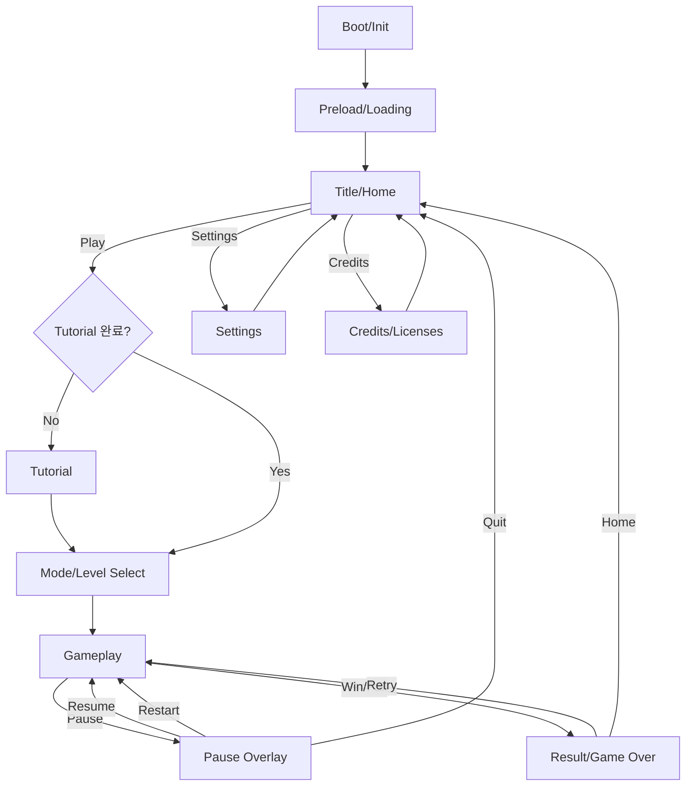

## Task 1: 기술 리서치 — React에서 쓸 웹 물리 엔진 비교

### 1) 2D 물리 엔진 후보

#### A. Matter.js (2D, Rigid Body)

* 핵심 특징: 브라우저용 **2D 강체(리지드바디) 물리**, 충돌/마찰/탄성/제약(Constraints) 지원 ([코드 바이 리아브루][1])
* 라이선스: MIT ([GitHub][2])
* 장점

  * “물리 느낌 나는” 캐주얼 게임(핀볼/스택/던지기/퍼즐) 구현이 빠름
  * 생태계가 크고, 예제/플러그인이 많음
* 단점

  * Box2D 계열 대비 “정밀한 조인트/접촉 안정성”이 필요한 경우 튜닝 부담이 생길 수 있음
  * React에 맞는 공식 래퍼는 제한적이라 **직접 루프/브릿지**를 설계해야 함
* React 적합도: **높음(2D 캐주얼/아케이드)**

  * 권장 조합: `Matter.js + Canvas/PixiJS` (렌더링은 React 밖에서 돌리고, React는 UI만)

#### B. Planck.js (2D, Box2D 스타일)

* 핵심 특징: **Box2D를 JS/TS로 재구현**한 2D 엔진 ([GitHub][3])
* 라이선스: MIT ([GitHub][4])
* 장점

  * Box2D 스타일의 “정석적인 2D 물리”(조인트/접촉/센서)로 설계하기 좋음
  * TS 친화적이고, 안정적인 퍼즐/플랫폼 물리 구성에 강함
* 단점

  * Matter.js 대비 “쉽게 때려 맞추는 물리 연출”은 구현 속도가 약간 느릴 수 있음(설계가 더 엄격)
* React 적합도: **중~높음(정교한 2D 물리/조인트 중심)**

#### C. Phaser 3 (프레임워크 + 물리: Arcade / Matter)

* 특징: Phaser는 **Arcade Physics(가벼움)** + **Matter.js(풀바디)**를 내장 ([Phaser Docs][5])
* Arcade는 사각형/원 형태 중심의 단순 물리로 빠르지만 한계가 명확 ([Phaser Docs][5])
* 물리 시스템 간 혼용(Arcade ↔ Matter) 제약이 있음 ([Phaser Docs][6])
* 장점

  * “게임 프레임워크”까지 포함(씬/애니/사운드/입력) → **게임 자체를 Phaser로 만들고 React는 껍데기(UI/라우팅)로** 쓰기 좋음
* 단점

  * React 컴포넌트 모델과 엔진 루프가 충돌하기 쉬워 **React 내부에 Phaser를 ‘임베드’**하는 패턴이 필요
* React 적합도: **중(엔진 주도 구조가 더 자연스러움)**

---

### 2) 3D 물리 엔진 후보 (R3F 포함)

#### D. Rapier (WASM 기반, 2D/3D)

* 핵심 특징: **2D/3D 물리 엔진**, JS 바인딩은 WASM 기반이며 로딩이 비동기 ([Rapier][7])
* 라이선스: Apache-2.0 ([Rapier][8])
* 장점

  * 성능/안정성 좋고, **snapshotting / (옵션) 결정론(determinism)** 같은 “게임에 유용한 기능” 언급 ([Rapier][8])
* 단점

  * WASM 초기 로딩/번들링을 고려한 로더 설계 필요 ([Rapier][7])
* React 적합도: **매우 높음(특히 R3F와 결합 시)**

  * `@react-three/rapier`는 R3F 파이프라인에 맞춘 래퍼 ([Pmndrs][9])

#### E. cannon-es (3D, 경량) + @react-three/cannon

* cannon-es: 경량 3D 물리 엔진, MIT ([GitHub][10])
* `@react-three/cannon`: cannon-es를 **React hooks 형태로 제공**, **웹 워커에서 실행(메인스레드 블로킹 완화)** ([NPM][11])
* 장점

  * React/R3F에서 “가장 빨리 붙는” 편(훅 기반)
  * 워커 실행로 UI 프레임 드랍을 줄이기 좋음 ([NPM][11])
* 단점

  * 매우 복잡한 제약/정밀 시뮬레이션은 Rapier/Ammo 대비 한계가 나올 수 있음
* React 적합도: **높음(3D 캐주얼/프로토타입/웹워커 이점)**

#### F. Ammo.js (Bullet 포팅)

* 특징: Bullet 물리 엔진을 Emscripten으로 포팅한 ammo.js ([GitHub][12])
* 장점

  * Bullet 기반 기능(예: 다양한 제약/고급 물리) 요구에 대응 가능
* 단점

  * API가 무겁고, 번들/셋업 복잡도가 높아 “클라이언트 단독 + 모바일”에 부담이 큼
* React 적합도: **중(고급 요구가 있을 때만)**

#### G. Oimo.js (경량 3D)

* 특징: 경량 3D 물리, MIT ([GitHub][13])
* 장점: 가볍게 쓰기 좋음
* 단점: 문서/생태계/유지보수 측면에서 대형 프로젝트에선 리스크(프로젝트 특성상 검토 필요)

---

### 3) 추천 결론(실무 기준)

* **2D 물리 게임(대부분 모바일 캐주얼)** → **Matter.js**(속도/연출 용이) 또는 **Planck.js**(Box2D 스타일의 안정성)
* **3D + R3F(react-three-fiber) 사용** → **Rapier + @react-three/rapier**가 가장 “현대적/성능/안정성” 균형이 좋음 ([Pmndrs][9])
* **3D인데 빠르게 만들고 워커로 분리하고 싶다** → **@react-three/cannon(cannon-es)** ([NPM][11])

---

## Task 2: 무료(또는 프리미엄 프리) 에셋 출처 + 라이선스 정리

> 주의: 특히 itch.io / OpenGameArt는 **에셋마다 라이선스가 다를 수 있으니 개별 항목의 라이선스 표기 확인**이 필수입니다.

| 분류               | 사이트              | 라이선스(대표/주요)                                                                | 실무 메모                                        |
| ---------------- | ---------------- | -------------------------------------------------------------------------- | -------------------------------------------- |
| 2D/3D/UI 팩       | Kenney           | CC0(퍼블릭 도메인) ([Kenney][14])                                                | 상업적 사용/수정 가능, 출처 표기는 선택                      |
| 2D/음악/효과음        | OpenGameArt      | CC0/CC-BY/CC-BY-SA/GPL/OGA-BY 등 다양한 라이선스 ([OpenGameArt.org][15])           | **상업용이면 GPL/SA 계열은 파급(ShareAlike) 위험** 검토 필요 |
| 2D/3D/픽셀         | itch.io (CC0 태그) | CC0 선택 가능(검색 필터) ([itch.io][16])                                           | “무료”라도 개별 페이지의 라이선스/조건 확인 권장                 |
| 아이콘(SVG/PNG)     | game-icons.net   | CC BY 3.0(저작자 표시 필요) ([Game Icons][17])                                    | 크레딧 화면에 저자 표기 루틴 필요                          |
| 폰트               | Google Fonts     | 주로 SIL OFL, 일부 Apache/Ubuntu 등 ([Google for Developers][18])               | 폰트 파일 포함 배포 시 라이선스 파일 동봉 관행                  |
| 이미지/배경/간단 SFX/음악 | Pixabay          | 자체 Content License(대체로 attribution 불필요) ([Pixabay][19])                    | 금지 사용(prohibited uses) 체크 필요                 |
| 음악/효과음           | Mixkit           | Mixkit Free License(대체로 attribution 불필요) ([Mixkit][20])                    | 항목 타입별 라이선스가 분리되어 있어 페이지 확인                  |
| 효과음              | ZapSplat         | 무료는 attribution 요구(표준 라이선스) ([ZapSplat - Download free sound effects][21]) | 크레딧 표기 전제. 표기 불가면 유료(골드) 고려                  |
| 효과음(커뮤니티)        | Freesound        | CC0 / CC BY / CC BY-NC 등(항목별) ([Open.Ed][22])                              | 상업 프로젝트는 **CC BY-NC 회피**가 안전                 |

**권장 운영 방식(클라이언트 단독 프로젝트에서 특히 중요)**

* `CREDITS.md`(또는 “Credits Scene”)를 만들어 **에셋명/제작자/라이선스/링크**를 정리
* 빌드 산출물에 `licenses/` 폴더로 라이선스 텍스트를 포함(폰트/코드/에셋)

---

## Task 3: 장면(Scene) 목록 정리 (역할 + 포함 요소)

아래는 “물리 기반 캐주얼 게임”의 **표준 씬 분해**입니다. (레퍼런스 게임에 맞춰 *Gameplay* 내부 오브젝트/규칙만 치환하면 됩니다.)

1. **Boot / Init**

* 역할: 해상도/입력/오디오 정책 초기화, 저장 데이터 로딩
* 요소: 디바이스 체크, FPS 목표 설정, Safe-area 계산, localStorage 로드

2. **Preload / Loading**

* 역할: 텍스처/스프라이트시트/사운드 프리로드 + WASM 로딩(Rapier 등)
* 요소: 로딩바, 팁 문구, 필수 에셋/지연 로딩 분리

3. **Title / Home**

* 역할: 진입 허브(Play, Settings, Credits)
* 요소: 메인 버튼, 최근 기록/최고 기록, 사운드 토글

4. **Tutorial (선택)**

* 역할: 조작/물리 상호작용 학습(드래그, 발사, 점프 등)
* 요소: 단계별 가이드, “다시 보지 않기” 토글

5. **Mode / Level Select (선택)**

* 역할: 레벨형/스테이지형이면 선택 화면 제공
* 요소: 스테이지 카드, 잠금/별점, 로컬 진행 저장

6. **Gameplay**

* 역할: 실제 물리 시뮬레이션 + 승패/점수 산정
* 요소(공통):

  * Physics World, Bodies/Constraints, Collision 이벤트
  * HUD(점수/시간/남은 시도)
  * 입력(마우스/터치), 일시정지 버튼
  * 결과 조건(목표 도달/시간 초과/파괴 등)
  * Debug 토글(개발 빌드 한정)

7. **Pause Overlay**

* 역할: 게임 루프 정지/옵션/재시작/나가기
* 요소: Resume, Restart, Settings Quick

8. **Result / Game Over**

* 역할: 성과 표시 + 재도전 유도
* 요소: 점수/기록/리플레이(선택), 다시하기/홈

9. **Settings**

* 역할: 입력/그래픽/오디오/접근성 설정
* 요소: 진동/사운드, 저사양 모드(바디 수 제한), 버튼 배치(모바일)

10. **Credits / Licenses**

* 역할: 에셋/라이선스 고지(상업 배포 대비)
* 요소: CREDITS 목록, 외부 라이선스 링크

---

## Task 4: 게임 진행 플로우차트 (Mermaid)

---

## Task 5: React 컴포넌트 설계 (책임 + 관계)

핵심 원칙: **물리 시뮬레이션/렌더 루프는 React 렌더 사이클과 분리**하고, React는 **UI/상태/라우팅**에 집중.

### 1) 추천 디렉터리/컴포넌트 트리(예시)

* `App`

  * `Router`(또는 간단한 SceneState)

    * `SceneBoot`
    * `SceneLoading`
    * `SceneHome`
    * `SceneTutorial`
    * `SceneSelect`
    * `SceneGame`
    * `SceneResult`
    * `SceneSettings`
    * `SceneCredits`

### 2) 핵심 “엔진 레이어” 컴포넌트

* **`GameCanvas`**

  * 책임: `<canvas>` 생성/리사이즈, DPR(devicePixelRatio) 관리, 렌더 루프 관리
  * React state 업데이트 최소화(렌더 루프에서 setState 남발 금지)

* **`PhysicsEngineProvider` (Context)**

  * 책임: physics world 인스턴스 생성/파괴, step 고정 타임스텝, 이벤트 디스패치
  * Matter/Planck일 경우: 엔진 객체를 `useRef`로 보관하고, tick은 `requestAnimationFrame` + accumulator로 처리

* **`InputController`**

  * 책임: PointerEvents 기반 입력 통합(마우스/터치), 제스처(드래그/홀드) 해석
  * 출력: “게임 명령” 이벤트(예: applyImpulse, spawn, dragConstraint)

* **`GameStateStore` (Zustand/Context/Reducer)**

  * 책임: 점수/상태(Playing/Paused/Result)/설정/진행 저장
  * **물리 바디의 실시간 좌표를 store에 넣지 말고**, UI에 필요한 최소 정보만 저장

* **`HUDOverlay`**

  * 책임: 점수/타이머/버튼/토스트 표시
  * 입력: GameStateStore + 이벤트(충돌 성공, 콤보 등)

* **`AudioManager`**

  * 책임: BGM/SFX 재생, 모바일 오디오 정책(사용자 입력 후 unlock) 처리

* **`PersistenceService`**

  * 책임: localStorage/IndexedDB로 진행/설정 저장(서버 없음 전제)

### 3) 상호 관계(데이터 흐름)

* InputController → PhysicsEngineProvider(명령 이벤트)
* PhysicsEngineProvider → GameStateStore(승패/점수/상태 이벤트)
* GameStateStore → HUDOverlay/Scene 라우팅
* Settings → (DPR/Quality/BodyLimit) → PhysicsEngineProvider & GameCanvas 반영

---

## Task 6: 반응형 최적화 전략 (모바일 + 데스크탑)

### A) 레이아웃 전략

* **Canvas는 “가변 크기”**: 컨테이너 기준으로 `resizeObserver`로 크기 반영
* Safe-area 대응: iOS notch 고려해 HUD에 `env(safe-area-inset-*)` 적용
* 화면 방향:

  * 기본은 Portrait(모바일) + Landscape(데스크탑)
  * 회전 시 “스케일만” 바꾸고 게임 월드 단위는 유지(월드 재생성 최소화)

### B) 입력 방식(터치/마우스 통합)

* Pointer Events 사용: `pointerdown/move/up`로 통합
* Canvas에 `touch-action: none;` 적용해 스크롤/줌 제스처 충돌 방지
* 모바일 전용 UI:

  * 엄지 영역에 버튼 배치(좌/우 하단)
  * 드래그 기반 게임이면 “드래그 핸들”을 크게 제공(미스 터치 감소)

### C) 성능 전략(물리 게임에서 가장 중요)

* **Fixed timestep + accumulator**(예: 60Hz 고정 step, 렌더는 rAF)
* **바디 수/컨스트레인트 수 상한**을 품질 옵션으로 제공(저사양 모드)
* Sleeping(수면) 적극 활용(지원 엔진이면), off-screen 오브젝트 제거
* React 렌더 최소화:

  * 매 프레임 setState 금지
  * 좌표/회전은 `ref`로 저장하고 캔버스 렌더러가 직접 참조
* WASM(예: Rapier) 사용 시:

  * 로딩 화면에서 async init 처리 ([Rapier][7])
  * 번들 분리(code splitting)로 초기 진입 속도 확보
* 워커 활용:

  * 3D에서 `@react-three/cannon`처럼 워커 기반이면 메인 스레드 안정성에 유리 ([NPM][11])
  * 2D(Matter/Planck)도 가능하지만 메시지/동기화 설계 비용이 커서 “성능 병목이 확인된 뒤” 적용 권장

[1]: https://brm.io/matter-js/?utm_source=chatgpt.com "Matter.js - a 2D rigid body JavaScript physics engine - brm·io"
[2]: https://github.com/liabru/matter-js?utm_source=chatgpt.com "liabru/matter-js: a 2D rigid body physics engine for the web"
[3]: https://github.com/piqnt/planck.js?utm_source=chatgpt.com "piqnt/planck.js: 2D JavaScript Physics Engine"
[4]: https://github.com/piqnt/planck.js/blob/master/LICENSE.txt?utm_source=chatgpt.com "planck.js/LICENSE.txt at master · piqnt ..."
[5]: https://docs.phaser.io/phaser/concepts/physics?utm_source=chatgpt.com "Physics | Phaser Help"
[6]: https://docs.phaser.io/phaser/concepts/physics/arcade?utm_source=chatgpt.com "Arcade Physics | Phaser Help"
[7]: https://rapier.rs/docs/user_guides/javascript/getting_started_js/?utm_source=chatgpt.com "Getting started"
[8]: https://rapier.rs/docs/?utm_source=chatgpt.com "About Rapier - 2D and 3D Physics Engines"
[9]: https://pmndrs.github.io/react-three-rapier/?utm_source=chatgpt.com "@react-three/rapier"
[10]: https://github.com/pmndrs/cannon-es?utm_source=chatgpt.com "pmndrs/cannon-es: 💣 A lightweight 3D physics engine ..."
[11]: https://www.npmjs.com/package/%40react-three/cannon?activeTab=readme&utm_source=chatgpt.com "react-three/cannon"
[12]: https://github.com/kripken/ammo.js?utm_source=chatgpt.com "kripken/ammo.js: Direct port of the Bullet physics engine to ..."
[13]: https://github.com/lo-th/Oimo.js?utm_source=chatgpt.com "lo-th/Oimo.js: Lightweight 3d physics engine for javascript"
[14]: https://kenney.nl/support?utm_source=chatgpt.com "Support"
[15]: https://opengameart.org/forumtopic/licensing-a-game?utm_source=chatgpt.com "Licensing a game"
[16]: https://itch.io/game-assets/assets-cc0?utm_source=chatgpt.com "Top game assets with assets under Creative Commons ..."
[17]: https://game-icons.net/about.html?utm_source=chatgpt.com "About"
[18]: https://developers.google.com/fonts/faq?utm_source=chatgpt.com "Frequently Asked Questions | Google Fonts"
[19]: https://pixabay.com/service/license-summary/?utm_source=chatgpt.com "Content License"
[20]: https://mixkit.co/license/?utm_source=chatgpt.com "Mixkit License"
[21]: https://www.zapsplat.com/license-type/standard-license/?utm_source=chatgpt.com "Standard License Agreement"
[22]: https://open.ed.ac.uk/how-to-guides/specialised-content-site/?utm_source=chatgpt.com "Specialised Content Site – Open.Ed"